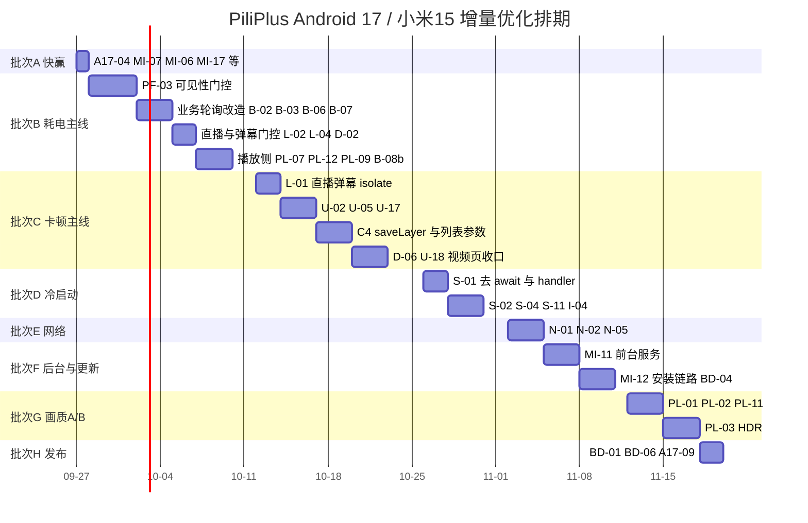

# PiliPlus Android 17 / 小米 15（澎湃 OS 4）性能 · 功耗 · 兼容性统一报告

> **本报告是两份来源文档的合并重写版**：
> - 来源 A：`perf-report/PiliPlus-Android.md`（2026-09-24）——74 项通用性能 / 发热 / 耗电 / 流畅度静态分析（P 12 / D 5 / L 7 / U 17 / I 6 / B 9 / N 4 / S 10 / A 4）。
> - 来源 B：`perf-report/PiliPlus-Android17-Xiaomi15.md`（2026-09-25）——Android 17 行为变更适配（A17 ×12）、澎湃 OS 4 / 小米 15 系统层（MI ×16）、播放与解码（PL ×10）、Android 专有补充（PF）、功能增强（FT ×8）、构建发布（BD ×5）。
>
> 合并规则：**保留全部原始编号用于回溯；两处重复的条目合并为一条并同时标注双编号**（对照表见 0.3）；同一问题只描述一次，不再重复叙述。

## 0. 文档信息与阅读方式

| 项目 | 内容 |
| --- | --- |
| 目标设备 | 小米 15（Snapdragon 8 Elite / Adreno 830，LTPO 1–120Hz，AMOLED） |
| 目标系统 | 澎湃 OS 4（基于 Android 17 / API 37） |
| 工程版本 | PiliPlus 3.0.1+1；Flutter 3.47.5；compileSdk / targetSdk = 37；AGP 9.0.1；Kotlin 2.3.20 |
| 分析方式 | 纯静态代码走查 + Android 官方行为变更逐条对照；**未运行 App、未修改文件、未做性能采样** |
| 代码快照 | 2026-09-25（`lib/`、`android/`、`pubspec.yaml`） |
| 可回溯性 | 所有结论均标注 `文件:行号`，可在实施前后用 `flutter run --profile` + DevTools 复核 |
| 方案编制 | **2026-09-26：新增第 12 章「增量优化实施方案」**——把第 1–11 章的 ⏳ 待办改写成可执行任务卡（落点 / 步骤 / 验证命令 / 验收线 / 回滚），并补 9 项新增编号（A17-13、MI-17、PL-11、PL-12、D-06、U-18、N-05、S-11、BD-06） |

### 0.1 标记说明

- **★ 数量**：优先级。`★★★` = 不做会出功能故障；`★★` = 收益明显；`★` = 优化项。
- **平台影响**：`仅 Android` = 改动落在 `android/` 目录或用 `Platform.isAndroid` 守卫，**不改变 iOS / 桌面行为**；`共享(lib/)` = 文件被多端共用，需加平台判断后再改。
- **状态**：✅ 已实施（2026-09-25）；⏳ 待办 / 待真机回归；⚠️ 需实测确认后才能定方案。

### 0.2 关于「只修改影响 Android 的代码」

本工程 `lib/` 与 iOS / macOS / Windows / Linux 共用。要满足「只影响 Android」，有三种干净的落点：

1. **`android/` 目录**（清单、Gradle、`res/xml`、Kotlin/Java）—— 天然只影响 Android。
2. **`lib/` 中的平台守卫**：`if (Platform.isAndroid) ...`、`if (PlatformUtils.isMobile) ...`、`DeviceUtils.sdkInt`。
3. **播放器 mpv 参数**：集中在 `lib/plugin/pl_player/controller.dart:749-775` 的 `opt` map（该 map 已有 `if (Platform.isAndroid) 'ao': ...` 的平台守卫先例），新增项同样加守卫即可；Android 侧默认值集中在 `lib/utils/storage_pref.dart`。

### 0.3 去重对照表（同一条目在两份来源中的编号）

| 问题 | 来源 A 编号 | 来源 B 编号 | 当前状态 |
| --- | --- | --- | --- |
| 唤醒锁缺少前后台门控 | P-01 | PF-01 | ✅ 已实施（前台 + 可见 + 播放中） |
| 播放心跳过于频繁 | P-02 | PF-01 | ✅ 已实施（5s → 15s） |
| 直播重连无节流 | P-07 / L-07 | PF-01 | ✅ 已实施（单定时器 + 3/6/12/24s 退避） |
| 骨架屏每帧动画 | U-01 | PF-01 | ✅ 已实施（全局共享 Ticker） |
| 图片磁盘缓存 1 GiB | I-01 | PF-01 | ✅ 已实施（降至 256 MiB） |
| 日志每条 flush、无轮转 | I-02 | PF-01 | ✅ 已实施（默认关闭 + 批量 flush + 轮转） |
| 重试无退避、不分幂等 | B-01 | PF-01 | ✅ 已实施（指数退避 + 抖动） |
| `video-sync: display-resample` | P-04 | PL-06 | ✅ 已实施（Android 默认改 `audio`） |
| 硬解失败无降级链 | P-05 | PL-05 | ✅ 已实施（降级链，开关化） |
| Anime4K 超分高负载 | P-06 | MI-09 | ✅ 已实施（低功耗自动降档 + 仅插电选项） |
| 刷新率钉死高刷 | B-05 | MI-02 | ✅ 已实施（场景化刷新率，默认不提升） |
| Impeller 被显式关闭 | A-02 | PL-01 | ✅ 开关化（默认仍关，A/B 免改代码） |
| release 未开 R8 / 资源压缩 | A-01 | BD-01 | ⏳ 待办 |
| `useLegacyPackaging = true` | A-03 | MI-07 / BD-03 | 保持现状，仅需校验 16 KB 对齐 |
| `enableJetifier` / `kotlin.incremental` | A-04 | BD-02 | ⏳ 待办（仅影响构建时间） |
| 启动流程多处 `await` | S-01 ~ S-04 | PF-02 #9 | ⏳ 待办 |
| 网络层 isolate / 连接池 | N-01 ~ N-03、B-04 | PF-02 #10 | ⏳ 待办 |
| 定时器统一治理 | B-09 全表 | PF-02 #11 / PF-03 | ⏳ 待办 |

---

## 1. 结论摘要

Android 17 + 澎湃 OS 4 对本 App 的影响可归为**三条主线**：

1. **后台音频被系统加固（最紧急）**。Android 17 起，音频框架限制「后台音频交互」；对 targetSdk 37 的应用，后台播放要求前台服务具备**使用时（WIU）**能力，否则音频会被**静默**掐断（不抛异常、无错误码）。本 App `enableBackgroundPlay` 默认开启，且 libmpv 走 NDK `AudioTrack.write`，正好落在受影响 API 清单里。
2. **本地网络权限强制（功能会直接坏）**。Android 17 对 targetSdk 37 应用强制 `ACCESS_LOCAL_NETWORK` 运行时权限，而本 App 有 **DLNA 投屏**（SSDP 组播发现）——不加权限会「搜不到设备」。
3. **小米侧两件事：后台存活 + 刷新率策略**。澎湃 OS 4 的省电/冻结策略决定「后台播放能不能活」；LTPO 1–120Hz 决定「应用内钉死高刷会不会白烧电」。

同时，来源 A 的静态走查指出：工程整体质量较高（图片内存缓存、控件层 `RepaintBoundary`、列表 `prototypeItem` 覆盖率都不错），但存在**若干条贯穿「播放—后台—熄屏」全链路的耗电放大器**，以及**成片出现的每帧级重建**。

### 1.1 最值得先做的十五件事

| # | 条目 | 预期收益 | 优先级 | 状态 |
| --- | --- | --- | --- | --- |
| 1 | 后台音频加固适配：FGS 生命周期重排 + 验证开关（A17-01） | 后台/熄屏播放不再被静默掐断 | ★★★ | ✅ |
| 2 | 申请并请求 `ACCESS_LOCAL_NETWORK`（A17-02） | DLNA 投屏在 Android 17 上恢复可用 | ★★★ | ✅ |
| 3 | 应用内存上限适配：图片缓存 + libmpv 缓冲预算（A17-03） | 避免进程因内存上限被杀 | ★★★ | ✅ |
| 4 | 后台长任务（下载/导出）改前台服务（MI-11） | 澎湃 OS 上不再被冻结 | ★★★ | ⏳ |
| 5 | 应用内更新安装链路（MI-12） | 更新成功率决定用户能否拿到本报告所有优化 | ★★★ | ⏳ |
| 6 | 澎湃 OS 权限引导页（MI-13） | 一次引导解决四类「玄学问题」 | ★★★ | ✅ |
| 7 | 场景化刷新率 + 视频同步策略（MI-02 + PL-06） | LTPO 可降频，续航与温控改善 | ★★ | ✅ |
| 8 | 低电量 / 温控降档（MI-04，含 MI-09） | 发热与掉电最有效的处置 | ★★ | ✅ |
| 9 | 启动流程重排（S-01 ~ S-04 / PF-02 #9） | 冷启动首帧 −200~500 ms | ★★ | ⏳ |
| 10 | 网络层 isolate 化与连接池调优（N-01 ~ N-03 / B-04） | 弱网与移动网络的耗电、卡顿 | ★★ | ⏳ |
| 11 | 直播弹幕解析移出 UI isolate（L-01 / PF-02 #7） | 直播间单核 CPU 大幅下降 | ★★ | ⏳ |
| 12 | 视频页 `Obx` 拆分 + 去掉 `Opacity`（P-08 / P-09 / PF-02 #1-2） | 视频页滚动帧率与 GPU 占用 | ★★ | ⏳ |
| 13 | 评论正则/`TextSpan` 结果缓存（U-02 / PF-02 #3） | 评论滚动 CPU 明显下降 | ★★ | ⏳ |
| 14 | HDR10 / 杜比视界输出与 tone-mapping（PL-03） | 小米 15 屏幕上画质与亮度明显提升 | ★★ | ⏳ |
| 15 | AV1 硬解与解码器白名单（PL-04） | 同画质更省电，失败可自愈 | ★★ | ✅（部分） |

> **本表是「结论层」的优先级**。要继续推进到这里列出的 ⏳ 项，请直接按 **第 12 章（第十部分）增量优化实施方案** 的批次顺序执行——那里有每张卡的落点文件、改造步骤、验证命令、验收线与回滚方式，批次顺序（A 快赢 → B 耗电主线 → C 卡顿 → D 启动 → E 网络 → F 后台/更新 → G 画质 A/B → H 发布）已按「收益 ÷ 风险」排过序。

### 1.2 最需要警惕的「组合拳」

`enableBackgroundPlay` 默认开启（`lib/utils/storage_pref.dart:660-661`）+ Wakelock 无门控（原 `controller.dart:907`）+ 心跳 5s（原 `controller.dart:1484`）+ 常驻前台服务与高频通知更新（`lib/services/audio_handler.dart:26-34`、`:74-140`）。四者叠加 = **熄屏后 CPU、网络、显示子系统仍在全速工作**，这是「手机烫、掉电快」最可能的直接原因。前两项已在 2026-09-25 落地修复，后续改动应以此为主线继续收口。

---

## 2. 问题总览（去重后）

| 模块 | 编号前缀 | 条目数 | 主要代价维度 |
| --- | --- | --- | --- |
| Android 17 行为变更 | `A17-xx` | 12 | 功能可用性 / 合规 |
| 澎湃 OS 4 / 机型系统层 | `MI-xx` | 16 | 后台存活 / 功耗 / 观感 |
| 播放与解码 | `P-xx`、`PL-xx` | 12 + 10（去重后合并为 10 条） | CPU / 发热 / 耗电 / 画质 |
| 弹幕系统 | `D-xx` | 5 | CPU / GPU / 发热 |
| 直播场景 | `L-xx` | 7 | CPU / 网络 / 耗电 |
| UI 渲染与列表 | `U-xx` | 17 | 流畅度 / GPU |
| 图片 / 主题 / 字体 | `I-xx` | 6 | 内存 / GPU |
| 后台服务与定时器 | `B-xx` | 9 | 待机耗电 / 唤醒 |
| 网络与序列化 | `N-xx` | 4 | CPU / 网络 / 流量 |
| 启动性能 | `S-xx` | 10 | 冷启动耗时 |
| 构建与发布 | `A-xx`、`BD-xx` | 4 + 5 | 体积 / 启动 / 帧率 |
| 功能增强 | `FT-xx` | 8 | 体验 / 转化 |

---

## 3. 第一部分：Android 17（API 37）行为变更适配清单

> 对照官方文档：《行为变更：以 Android 17 或更高版本为目标平台的应用》《行为变更：所有应用》（最后更新 2026-09-16 / 18）。每条均注明是「所有应用都受影响」还是「仅 targetSdk 37」。

### A17-01 后台音频加固：后台播放、音频焦点、音量 API 会被静默限制 ★★★ ✅已实施

**变更内容**

- 所有应用（不论 targetSdk）：在后台与音频 API 交互时，必须有**可见的 Activity** 或**运行中的非 `SHORT_SERVICE` 前台服务**。
- 仅 targetSdk 37：该前台服务还必须具备**使用时（WIU）**能力；否则后台音频播放**静默失败**（NDK `AudioTrack.write` / AAudio / OpenSL ES 无声、无异常），音频焦点请求直接返回 `AUDIOFOCUS_REQUEST_FAILED`，音量类 API 被静默忽略。
- 官方明确：**画中画（PiP）视为可见 Activity，不受该变更影响**。

**对本 App 的影响（证据）**

- `lib/utils/storage_pref.dart:664-665`：`enableBackgroundPlay` 默认 **true**，属官方点名的需合规场景。
- `lib/services/audio_handler.dart:26-34`：`androidNotificationOngoing: true` + `androidStopForegroundOnPause: true`（暂停即退出前台）。
- `lib/services/service_locator.dart:8-10` → `lib/services/audio_handler.dart:22`：`AudioService.init(...)` 在 `lib/main.dart:117-120` 被 **`await`**（此时 App 在前台 → 该 FGS 天然获得 WIU 能力，这是好事）。
- libmpv 音频输出走 NDK 写入，属官方「受影响 API」第一类；`lib/services/audio_session.dart:18-20` 的焦点与耳机拔出监听同样在清单内。
- 风险点：播放结束后 FGS 若未及时停止、或用户在**后台**重新起播，FGS 可能不具备 WIU → 表现为「后台播放走着走着没声音/不自动续播」，且**没有任何报错**。

**实现要点（已落地）**

1. 播放前先把「播放中」状态推给 audio_service，让前台服务**先于**音频写入进入前台。
2. 保持「在用户点击播放（App 可见）时启动 `mediaPlayback` FGS」的模式，不在后台/开机场景起播。
3. 打断结束后的自动续播，**仅 Android 17+** 在「应用不可见且前台服务未运行」时改为挂起，回到前台再续（Android 12–16 保持原有行为，不回归）。
4. 播放永久结束时停止 FGS 与媒体会话；瞬时故障（缓冲、`AUDIOFOCUS_LOSS_TRANSIENT`）期间保持 FGS 有效。

**验证方式**：`adb shell cmd audio set-enable-hardening enable` 后跑后台播放；`adb dumpsys audio` 或 logcat 过滤 `AudioHardening`，`level: full` = FGS 缺 WIU，`level: partial` = 完全没有 FGS。

**落点**：`lib/services/audio_handler.dart`、`lib/plugin/pl_player/controller.dart`、`lib/services/audio_session.dart`。平台影响：`共享(lib/)`。

---

### A17-02 本地网络权限：DLNA 投屏必须先申请 `ACCESS_LOCAL_NETWORK` ★★★ ✅已实施

**变更内容**：Android 17 对 targetSdk 37 应用强制 `ACCESS_LOCAL_NETWORK` 运行时权限（属 `NEARBY_DEVICES` 权限组）。Android 16 为可选项，Android 17 起强制执行。

**对本 App 的影响（证据）**

- `pubspec.yaml:75`：`dlna_dart: ^0.1.0`；`lib/pages/dlna/view.dart:19-20` `DLNAManager()`、`:36` `_searcher.start()`（SSDP 组播发现）、`:118` `device.setUrl(...)` + `device.play()`。
- 原先 `AndroidManifest.xml` **未声明**该权限 → Android 17 上投屏页搜不到任何设备（组播被系统阻断），且很可能**不报错**。

**实现要点（已落地）**

1. `AndroidManifest.xml` 声明 `ACCESS_LOCAL_NETWORK`。
2. `DeviceUtils.sdkInt >= 37` 时在搜索前申请；被拒时提示「打开设置」。
3. 搜索失败时**区分「无权限」与「无设备」**（原先 `:88-92` 只提示「没有设备」，会掩盖权限问题）。
4. 权限只对 Android 17+ 请求，旧版本保持原行为。

**落点**：`android/app/src/main/AndroidManifest.xml`、`lib/pages/dlna/view.dart`。平台影响：`android/` + `共享(lib/)`。

---

### A17-03 应用内存上限（MemLimiter）：给图片缓存与 libmpv 缓冲设预算 ★★★ ✅已实施

**变更内容**：Android 17 引入**按设备总 RAM 计算的应用内存上限**（所有应用生效）。命中时通过 `ApplicationExitInfo` 报告，退出原因为 `REASON_OTHER`、描述含 `"MemoryLimiter:AnonSwap"`。官方提供 `adb shell am memory-limiter status|manual|ignore` 调试。

**对本 App 的影响（证据）**

- 图片：`lib/utils/storage_pref.dart:620-621` 磁盘缓存上限 256 MiB，但内存侧另有 Flutter `ImageCache`（默认 100 MiB / 1000 张），大图瀑布流 + 宫格会顶到上限。
- 播放：`lib/utils/storage_pref.dart:827-828` `bufferSize` 默认 4.0；`:841-848` 直播缓冲 `demuxer-max-bytes = bufferSize * 0x200000`（**2 倍系数**）→ 直播默认约 8 MiB 解码缓冲，加上 libmpv 内部缓存与 4K 解码帧缓冲，native 侧占用不小。
- 弹幕：热门视频/直播间弹幕与聊天列表在 UI isolate 常驻（`lib/pages/live_room/controller.dart:3` `_kMaxChatCount = 500`）。

**实现要点（已落地）**

1. 新增 `lib/utils/memory_budget.dart`：按设备物理内存设图片缓存预算（低内存 / < 4 GiB = 64 MiB、≥ 8 GiB = 192 MiB、其它 128 MiB）。
2. 内存紧张时点播/直播解码缓冲减半。
3. 灰度观察：`adb shell dumpsys activity exit-info <包名>` 检查是否出现 `MemoryLimiter:AnonSwap`。

**落点**：`lib/utils/memory_budget.dart`（新增）、`lib/main.dart`、`lib/utils/storage_pref.dart`。平台影响：`共享(lib/)`。

---

### A17-04 证书透明度（CT）默认开启 + ECH 默认启用：建议新增网络安全配置 ★★ ⏳

**变更内容**

- **CT 默认启用**：targetSdk 37 起证书透明度默认开启（Android 16 需主动选择）。
- **ECH 默认启用**：targetSdk 37 起 TLS 使用加密 Client Hello；官方提供 `network_security_config.xml` 的 `<domainEncryption>` 元素按域开关。
- **`usesCleartextTraffic` 弃用计划**：官方建议改用网络安全配置文件表达明文策略。

**对本 App 的影响（证据）**

- 工程**完全没有** `android:networkSecurityConfig`（清单无该属性，`res/xml/` 下也无对应文件）。
- 网络栈：`dio` + `dart:io HttpClient`（`lib/http/init.dart:151` 起）与可选 HTTP/2（`lib/utils/storage_pref.dart:745-746`，默认 false）；`flutter_inappwebview` 走系统 WebView（Chromium 系，**支持 ECH**）。
- 风险场景：① 部分 CDN / 直播源证书链缺 SCT 时连接可能被拒；② 用户使用代理、抓包或企业网络时 ECH 与中间盒交互可能异常；③ 未来移除 `usesCleartextTraffic` 后，若靠它放行明文会突然失效。

**建议改法**

1. 新增 `android/app/src/main/res/xml/network_security_config.xml`，并在清单 `application` 引用。
2. 基线 `<base-config cleartextTrafficPermitted="false">`；本工程 `lib/` 未检索到 `http://` 直连，可先不开例外。
3. `<domainEncryption>disabled</domainEncryption>` 与 CT 相关配置**默认不写**，只保留注释与排障说明；实测出现 TLS 失败再对具体域关闭（比提前关闭安全性更保守）。
4. 把该文件当作「明文策略」的唯一来源，为 `usesCleartextTraffic` 弃用做准备。

**平台影响**：`仅 Android`。

---

### A17-05 隐式 URI 授权收紧（Android 18 生效，现在就该改） ★ ⏳

**变更内容**：目前 `ACTION_SEND` / `ACTION_SEND_MULTIPLE` / `ACTION_IMAGE_CAPTURE` 由系统自动授予 URI 读写权限；**从 Android 18 起不再自动授予**。官方建议现在就显式加 `FLAG_GRANT_READ_URI_PERMISSION`（拍照再加 WRITE）。

**对本 App 的影响（证据）**：分享链路（`share_plus`）、图片链路（`image_picker` → `image_cropper`（清单注册了 `com.yalantis.ucrop.UCropActivity`）→ `saver_gallery`）；`AndroidHelper.openUrl()`（`AndroidHelper.java:302-338`）与外部跳转也未显式加授权标志。

**建议改法**

1. 凡主动构造 `ACTION_SEND*` / `ACTION_IMAGE_CAPTURE` 处（含 Kotlin/Java 侧）补 `FLAG_GRANT_READ_URI_PERMISSION`（拍照再补 WRITE）。
2. 用官方 StrictMode 探针扫一遍：`StrictMode.VmPolicy.Builder().detectImplicitUriPermissionGrant()`，或 `adb logcat | Select-String "Please set the grant explicitly in the app"`。
3. 用 `FileProvider` 的 `content://` 而非 `file://` 传递临时文件。

**平台影响**：`仅 Android` + `共享(lib/)` 中带平台的分享调用。

---

### A17-06 预测性返回：现有「关闭」开关已失效，自实现的返回桌面逻辑要复核 ★★ ✅已实施

**变更内容**：Android 16 起，对 targetSdk 36+ 的应用**预测性返回默认开启且忽略退订**。本工程 targetSdk 37，原先却仍写着退订。

**对本 App 的影响（证据）**

- `android/app/src/main/AndroidManifest.xml:33` 原为 `android:enableOnBackInvokedCallback="false"` —— 在 Android 17 上**已不产生效果**（Flutter 也只有该值为 true 时才注册返回回调）。
- `AndroidHelper.back()`（`AndroidHelper.java:71-76`）自己构造 `ACTION_MAIN` + `CATEGORY_HOME` 启动桌面，配合系统预测性返回动画可能出现行为不一致。
- 视频/直播全屏有大量自定义返回处理（`lib/plugin/pl_player/utils/fullscreen.dart`、`lib/pages/video/view.dart` 的 `PopScope` 一类逻辑）。

**实现要点（已落地）**：`enableOnBackInvokedCallback` 由 `false` 改为 `true`（Android 16+ 已强制，写 `false` 无效果，改为显式声明才能与真实行为一致）。`BackDetector` 只是鼠标返回键监听，不受影响。后续仍需：优先使用 `PopScope` / `SystemNavigator.pop()`，只有「首页再按一次返回桌面」才保留 `AndroidHelper.back()`；全屏、锁屏、弹幕输入框、PiP 四种状态各回归一次返回手势。

**平台影响**：`仅 Android`。

---

### A17-07 静态 final 不可修改 + 原生库动态加载必须只读：校验 JNI 与 `.so` 加载 ★★ ⏳

**变更内容**

- targetSdk 37 起，反射修改 `static final` 字段会抛 `IllegalAccessException`；通过 JNI（如 `SetStaticLongField()`）修改会**直接崩溃**。
- `System.load()` 加载的原生库文件**必须标记为只读**，否则抛 `UnsatisfiedLinkError`（Android 14 对 DEX/JAR 的同类保护扩展到原生库）。

**对本 App 的影响（证据）**

- 反射读系统静态字段：`AndroidHelper.fontFamilies()`（`AndroidHelper.java:253-273`）通过 `getDeclaredMethod("getSystemFontMap")` / `getDeclaredField("sSystemFontMap")` 读 `Typeface` 内部字段。**只读**且在 try/catch 内，理论安全，但属「隐藏 API + 静态字段」组合，需实测「系统字体」页仍能列出字体。
- 原生库：`media_kit` 的 `libmpv.so`、`jni_flutter` 的 `libjni.so`、`flutter_inappwebview` 等；`android/app/build.gradle.kts:41` 的 `packagingOptions.jniLibs.useLegacyPackaging = true` 意味着库会**解压到文件系统**，加载路径与文件权限更值得校验。

**建议改法**

1. 真机回归：启动、播放、投屏、图片选择、字体列表、PiP、快捷方式创建。
2. 校验所有 `.so` 从只读的 `/data/app/.../lib/arm64/` 加载，不存在「先拷到可写目录再 `System.load()`」的实现。
3. 给 `fontFamilies()` 增加失败兜底（返回 null → UI 回退内置字体列表）。
4. **不建议**主动去「修」反射本身（风险高），优先确认行为 + 加兜底。

**平台影响**：`仅 Android`。

---

### A17-08 MessageQueue 换新实现：插件的反射使用需回归 ★ ⏳ 需真机回归

**变更内容**：targetSdk 37 起 `android.os.MessageQueue` 使用新的无锁实现，**可能破坏反射其私有字段/方法的客户端**。

**对本 App 的影响**：Dart 层不使用 `MessageQueue` 反射；风险主要在原生插件（「主线程卡顿检测 / 消息队列监控 / 反射 `mMessages`」类库）。本工程 release 默认 `enableLog = false`（`lib/utils/storage_pref.dart:641-642`），也不挂性能监控 SDK（`lib/main.dart:191-215`），**风险较低**。但 `flutter_inappwebview`、`saver_gallery`、`audio_service`、`image_cropper` 等都有原生代码，仍需一次全链路回归。

**回归清单**：WebView 播放/全屏、保存图片、通知控制、裁剪、PiP、投屏。若有自定义 `MessageQueue` 相关代码，改用 `Looper.getMainLooper().setMessageLogging(...)` 之类公开 API。

**平台影响**：`仅 Android`。

---

### A17-09 大屏（sw ≥ 600dp）忽略方向/尺寸限制：折叠屏与平板需要横向适配 ★ ⏳

**变更内容**：Android 16 起，大屏（sw ≥ 600dp）设备会忽略应用的屏幕方向、宽高比与可调整大小性限制；Android 17 起对 targetSdk 37 强制，**不再提供退订**。

**对本 App 的影响（证据）**

- 默认竖屏锁定：`lib/main.dart:117-120` 走 `portraitUpMode()`（`Pref.horizontalScreen` 为 false 时），全屏播放时再切横屏（`lib/plugin/pl_player/controller.dart` 的 `_onOrientationChanged`）。
- 已有折叠屏/多窗口感知：`AndroidHelper.isFoldable`（`AndroidHelper.java:48-53`）、`lib/utils/max_screen_size.dart:12-18`、`MainActivity.kt:11-16`。
- 小米 15 本身是手机（sw < 600dp），**不受影响**；但同族设备（MIX Fold / 平板）与「手机 + 分屏」会走大屏路径。

**建议改法**：明确大屏布局策略（扩展 `Pref.horizontalScreen` 为「大屏自动横向 + 不锁定方向」）；校验 `MaxScreenSize.isWindowMode()` 在 Android 17 分屏/悬浮窗下判定仍正确；校验视频页在「分屏 + 横屏 + 悬浮窗」下的全屏切换不打架。

**平台影响**：`共享(lib/)`，可用 `Platform.isAndroid` + `isFoldable` 守卫。

---

### A17-10 旋转后 IME 可见性不再自动恢复 ★ ⏳（预计不触发）

**变更内容**：所有应用（Android 17 起），若配置变更未被应用自身处理，旋转后**不会**恢复之前的软键盘可见状态；需要 `windowSoftInputMode="stateAlwaysVisible"` 或代码显式请求。

**对本 App 的影响**：清单里 Activity 的 `configChanges` 已包含 `orientation|screenSize|keyboardHidden|keyboard`（`AndroidManifest.xml:38-46`），即**应用自己处理**旋转，这条变更大概率不触发。但 `android:windowSoftInputMode="adjustResize"` 已设置，键盘相关页面（搜索、弹幕输入、评论、私信）需各测一次。

**建议改法**：只做回归（竖屏输入 → 旋转 → 确认键盘与焦点正常）；若确实出现键盘消失且无法唤起，再在对应输入框加显式 `requestFocus` + `showKeyboard`。

**平台影响**：`仅 Android`。

---

### A17-11 内容捕获 API 弃用：如需防录屏请改用 `FLAG_SECURE`（可选功能） ★ ⏳

**变更内容**：targetSdk 37 起 `ContentCaptureManager.setContentCaptureEnabled(false)` 不再停用内容捕获；如需阻止系统捕获屏幕内容，必须用 `WindowManager.LayoutParams.FLAG_SECURE`。

**对本 App 的影响**：工程未使用 `setContentCaptureEnabled`，**无兼容问题**。但它可变成一个**功能**：为「登录页 / 二维码 / 部分付费或私人内容页」加 `FLAG_SECURE`（同时获得「防截屏 + 不进入最近任务预览」的效果），也顺带挡住澎湃 OS 4 端侧智能的屏幕内容读取。

**建议改法**：作为可选开关加入「设置 → 隐私」（默认关），仅对 Android 生效，在 `MainActivity` 通过 JNI 方法切换窗口标志；**不要**在播放页全局开启（会影响截图分享与 PiP 观感）。

**平台影响**：`仅 Android`。

---

### A17-12 蓝牙重新配对、跨配置文件回环流量、Keystore 密钥上限：确认无影响 ★ ✅

- **蓝牙自动重新配对**：仅影响「绑定丢失后的重连」流程；本 App 通过 `audio_session` 监听音频路由，不直接操作蓝牙，**无需改**。回归时用蓝牙耳机断连/重连验证「拔出耳机暂停」与音频焦点。
- **跨配置文件回环流量被阻断**：本 App 不监听本地端口（`lib/main.dart:398` 的 `_CustomHttpOverrides` 只做证书校验覆盖），**无需改**；工作资料（分身）场景若有「分屏/投屏异常」反馈再排查。
- **Keystore 每应用密钥上限**（targetSdk 37：5 万）：本 App 不批量生成密钥，**无需改**。

---

## 4. 第二部分：澎湃 OS 4 / 小米 15 系统层

> 本部分依赖具体 ROM 行为，**所有结论都要在真机上复核**；每条给出可执行的验证方式，避免「照抄参数」。

### MI-01 后台存活：自启动白名单 + 电池优化引导 ★★ ⏳

Android 17 已用「WIU 前台服务」给后台播放立了规矩（A17-01），而澎湃 OS 4 在系统层还会「应用冻结 / 后台清理 / 省电策略」。两者叠加时，表现往往是「系统层把进程冻结」而不是「音频框架拒绝」。

**改法**：新增「后台播放健康检查」引导页（仅 Android），一键跳转 ① 应用详情 → 省电策略「无限制」；② 自启动管理；③ 锁定最近任务。跳转优先 `Settings.ACTION_REQUEST_IGNORE_BATTERY_OPTIMIZATIONS`，小米自启动页用 `ComponentName("com.miui.securitycenter", "com.miui.permcenter.autostart.AutoStartManagementActivity")` 并**必须 try/catch 回退**到应用详情页。在用户开启「后台播放」时做一次检查（而不是启动时弹窗打扰）。

**平台影响**：`仅 Android`（运行时跳转，清单无需改）。**注**：该项已由 MI-13 覆盖落地。

### MI-02 场景化刷新率：别在应用内钉死高刷（LTPO 1–120Hz） ★★ ✅

**原状（证据）**：`lib/main.dart:150-161` 启动后 `FlutterDisplayMode.setPreferredMode(displayMode ?? DisplayMode.auto)`；`lib/pages/setting/pages/display_mode.dart:58`、`:82` 用户可任选任意档位（含 120Hz）。而 `Opacity`（`lib/pages/video/view.dart:634`）、全屏 `saveLayer`（`lib/pages/live_room/view.dart:412`）、弹幕 Canvas（`lib/pages/danmaku/view.dart:158-177`）、骨架屏都是「每帧重绘」型负载，高刷下显示子系统功耗接近翻倍；LTPO 一旦被要求 120Hz 就下不去。

**实现要点（已落地）**：新增 `lib/utils/android/display_mode_utils.dart`；`play_settings.dart` 加开关；`display_mode.dart` 联动。

1. **默认不再主动提升刷新率**（`DisplayMode.auto` 保持，强制高刷下沉为高级选项）。
2. 视频场景（`container-fps` ≤ 45）、低功耗、画中画时降到 60Hz 档，退出后恢复用户档位。
3. 帧率设置页打开期间暂停降档，避免把降档结果写回成「用户档位」。

**平台影响**：`仅 Android`。

### MI-03 通知权限与澎湃媒体控件 ★★ ✅

澎湃 OS 4 的媒体控件从 `MediaSession` 读取元数据并对通知做渠道分组。**问题**：未授权通知时，媒体控制条/锁屏控件不显示，用户会误判「后台播放无效」。

**实现要点（已落地）**：`play_settings.dart` 在开启「后台音频服务」时申请 `POST_NOTIFICATIONS`。**后续建议**：通知渠道细分（播放控制 / 下载进度 / 应用更新各自独立）；给 `MediaItem` 补全 `artwork`（小米锁屏/胶囊控件依赖它显示封面）；位置更新节流，避免澎湃 OS 上「通知频繁刷新被降级」。

**落点**：`play_settings.dart`、`lib/services/audio_handler.dart`。平台影响：`共享(lib/)` + `android/`。

### MI-04 低电量 / 温控降档：把系统信号接进播放与渲染策略 ★★ ✅

**原状**：工程已依赖 `battery_plus`（仅用于显示），但超分着色器（`controller.dart:685-721` Anime4K CNN）、弹幕描边/海量模式、高刷、预读缓冲都是「静态选项」，不随设备状态变化。

**实现要点（已落地）**：新增 `lib/services/power_save_watcher.dart`、`lib/utils/device_state.dart`；`AndroidHelper.java` 新增 `thermalStatus()`。

- 省电模式 / 未充电且 < 20% / 温控 ≥ MODERATE 判定为低功耗 → 刷新率 60Hz + 临时清空 glsl-shaders（**不落盘改用户设置**）+ 弹幕区域 ×0.6 且去描边 + 缓冲 ×0.75。
- 仅应用可见时 3 分钟轮询。
- UI 上以一行提示说明「已开启省电模式，画质/动效已降档」，避免用户以为画质变差是 bug。

**平台影响**：`共享(lib/)` 策略层 + `android/` 新 JNI 方法。

### MI-05 亮度策略：默认走「窗口亮度」而非系统亮度 ★ ⏳（保持现状）

`lib/utils/storage_pref.dart:998-999` `setSystemBrightness` 默认 **false** → 走 `ScreenBrightnessPlatform.setApplicationScreenBrightness`；退出时复位。清单却声明了 `WRITE_SETTINGS`（特殊权限）。

**建议**：保持默认（窗口亮度）不变——这是正确的、不需要特殊权限的做法；仅当用户开启「调节系统亮度」时才请求 `WRITE_SETTINGS`（`Settings.ACTION_MANAGE_WRITE_SETTINGS`）并显示明确状态，未授予时不静默失败；回归「退出播放页一定复位亮度」（`:374-375`、`lib/pages/live_room/view.dart:177-178`、`controller.dart:1795-1796`）。

**平台影响**：`仅 Android`。

### MI-06 纯黑主题 + 深色模式：AMOLED 省电与观感 ★ ⏳

已有 `values-night-v31/styles.xml` 夜间启动主题（`#212121`）、应用内 `isPureBlackTheme`、动态取色（默认 true）。

**建议**：启动主题 `windowSplashScreenBackground` 夜间改**纯黑 `#000000`**，减少启动瞬间「灰块」观感与一点功耗；设置中说明「纯黑主题可省电（AMOLED）」并在省电模式下询问是否切换；`android:forceDarkAllowed=false` 已设正确，保持不动。

**平台影响**：`仅 Android`。

### MI-07 16 KB 页大小与 `libmpv.so` 对齐校验 ★★ ⏳

`android/app/build.gradle.kts:41` `useLegacyPackaging = true`（原生库解压安装）；原生库体积大（`libmpv.so`、`libjni.so`），CI 用 `--split-per-abi`。

**建议（校验优先，不急于改配置）**

1. 真机确认页大小：`adb shell getconf PAGE_SIZE`（16384 即 16 KB）。
2. 校验对齐：`zipalign -c -P 16 -v 4 app-arm64-v8a-release.apk`；对 `.so` 检查 ELF LOAD 段 `Align` 应为 `0x4000`。
3. 若未对齐：优先升级 `media_kit` 版本 / 用 NDK 重新编译，而不是靠构建开关绕过。
4. `useLegacyPackaging = true` 保持现状（解压安装换更快的加载与内存映射）是合理取舍，**只需校验对齐通过**。

**平台影响**：`仅 Android`。

### MI-08 音频输出：ao 选择与澎湃音频特性 ★★ ✅（默认值）

`lib/plugin/pl_player/controller.dart:751-756` Android 下 `'ao': Pref.audioOutput`；会话配置 `AudioSessionConfiguration.music()`。

**实现要点（已落地）**

1. `ao` 默认顺序改为 **AAudio → AudioTrack → OpenSL ES**（OpenSL ES 已被官方标记待弃用，`audio_output_type.dart`）。
2. 顺带修掉转码路径 `no,auto-copy` 的无效拼接（会让 mpv 完全关掉硬解，`mpv_convert_webp.dart`）。
3. **仍建议**在小米 15 上实测「起播延迟、切轨断续、蓝牙切换表现」，确认默认值最优；音频焦点失败要有兜底提示（联动 A17-01）。

**平台影响**：`仅 Android`。

### MI-09 超分（Anime4K）与弹幕的「功耗提示 + 自动降档」 ★ ✅

`controller.dart:685-721` 有 `efficiency` / `quality` 两档，`quality` 是 CNN 卷积系列（高负载）；入口安全（只在 `isAnim` 且用户主动开启时生效），但原先**没有功耗提示、没有「仅插电时启用」、没有低电量自动关闭**。

**实现要点 / 后续**：设置页标注「高耗电 / 明显发热」并提供「仅插电时启用」；低电量 / 省电模式 / 高温时自动切到 `efficiency` 或关闭（已与 MI-04 合并实现）；弹幕 `massiveMode` 同样分级并在低电量时降低显示区域与描边。

**平台影响**：`共享(lib/)`（超分跨平台，策略只对 Android 生效）。

### MI-10 深色 / 高亮屏的显示细节 ★ ⏳（确认项）

- **峰值亮度**：小米 15 手动/激发亮度差异大，窗口亮度模式下亮度手势最大只能到 100%；提示中应说明「提升亮度需关闭跟随系统亮度」。
- **分辨率/像素密度**：`lib/utils/max_screen_size.dart` 取最大窗口尺寸（dp），建议在超宽屏/分屏下回归视频卡片宽高比与 `Style.aspectRatio` 不被拉伸。
- **护眼/色温**：系统级功能，App 不应自实现，播放页不要覆盖系统色温设置。

**平台影响**：`仅 Android`。

### 4.1 澎湃 OS 专项补充（第三批）

> 前 10 条覆盖「通用 + 机型」层面。下面 6 条是**澎湃 OS 特有**的高收益项：同样做法在 AOSP 上收益有限，但在澎湃 OS 上因「冻结后台进程、拦截后台起 Activity、安装/通知附加系统门槛」而价值很高。

### MI-11 后台长任务存活：下载 / 导出改前台服务 ★★★ ⏳

**现状（证据）**：`lib/services/download/download_manager.dart`、`download_service.dart` 是纯 Dart 侧实现——该目录下**无前台服务、无通知、无 wakelock、无独立 Isolate**（逐项 grep 均无命中）。下载/导出完全依赖 App 进程存活，澎湃 OS 切后台或锁屏后容易被冻结，用户看到「下载莫名暂停/失败」。

**建议改法**

1. 下载与长时导出（WebP 导出、离线缓存）转为 Android 前台服务，类型 `dataSync`（清单加 `FOREGROUND_SERVICE_DATA_SYNC`），通知带进度与暂停/继续。
2. 注意 Android 15+ 对 `dataSync` FGS 有「每天 6 小时」上限：超长任务改用 Android 14+ 的**用户发起数据传输 Job**（`JobInfo.Builder.setUserInitiated(true)`，由系统托管进度通知）。
3. 完成/失败在通知与页面双通道播报。

**平台影响**：`仅 Android`。成本：中等（新增原生能力与通知渠道，注意 FGS 类型与时长合规）。

### MI-12 应用内更新：补齐安装链路 ★★★ ⏳

**现状（证据）**：`lib/utils/update.dart:119-146` `onDownload()` 只做 `PageUtils.launchURL(browser_download_url)`；全仓**没有** `REQUEST_INSTALL_PACKAGES`、没有 `FileProvider`、没有安装相关代码。后果：国内直连 GitHub 慢且易失败；即便下完，澎湃 OS 还要「允许安装未知应用」的 per-app 授权 + 安全扫描 + 二次确认。

**建议改法**

1. 应用内下载（复用 MI-11 的前台服务），支持断点续传与加速/镜像地址回退。
2. 下载完成后用 `FileProvider` 的 `content://` + `ACTION_VIEW`（`application/vnd.android.package-archive`）拉起安装器；清单加 `REQUEST_INSTALL_PACKAGES`，未授权时跳「安装未知应用」设置页（见 MI-13）。
3. 安装前校验签名 / `sha256`，避免下载被篡改。
4. 保留「前往 GitHub Release」作为兜底入口。

**平台影响**：`仅 Android`。成本：中等。

### MI-13 澎湃 OS 权限引导页：一键直达四个开关 ★★★ ✅

**现状（证据）**：全仓原无任何小米 / 澎湃 OS 设置页跳转（`miui.*`、`com.miui.*`、`IGNORE_BATTERY_OPTIMIZATIONS` 均无命中）。

**实现要点（已落地）**：新增 `lib/pages/setting/pages/hyperos_compat.dart`，`extra_settings.dart` 加入口「其它设置 → 澎湃 OS 兼容性检查」；`AndroidHelper.java` 新增 `openAppSettings(type)` 与 `isIgnoringBatteryOptimizations()`。四项状态与跳转：

| 项 | 用途 | 跳转方式 | 状态读取 |
| --- | --- | --- | --- |
| 自启动 | 后台播放 / 下载存活 | `ComponentName("com.miui.securitycenter", "com.miui.permcenter.autostart.AutoStartManagementActivity")` | 系统不给读接口，需手动确认 |
| 省电策略＝无限制 | 后台存活；并申请电池优化白名单 | `ACTION_REQUEST_IGNORE_BATTERY_OPTIMIZATIONS` + `package:` URI | 读真实值 |
| 后台弹出界面 | 后台拉起安装器/外部 App、投屏控制 | 小米权限管理页 | 需手动确认 |
| 通知权限 | 媒体控制条、下载/更新通知 | `POST_NOTIFICATIONS`（MI-03 已做请求） | 读真实值 |

所有小米组件名**必须 try/catch 回退**到 `ACTION_APPLICATION_DETAILS_SETTINGS` —— 澎湃 OS 各版本组件名会变。**平台影响**：`仅 Android`。

### MI-14 MI-02 的落地校验：系统「按应用自定义刷新率」会覆盖 `setPreferredMode` ★★ ✅

**风险**：`display_mode_utils.dart` 通过 `FlutterDisplayMode.setPreferredMode` 切档，但澎湃 OS 的「设置 → 显示 → 屏幕刷新率 → 自定义」可为**单个应用**指定刷新率，此时系统忽略应用请求 → MI-02 的省电收益**静默失效**。

**实现要点（已落地）**：请求低档 1.2s 后回读真实生效值（`FlutterDisplayMode.active`），被系统覆盖时置位 `systemOverridden`，并在兼容性检查页给出告警 + 跳转显示设置（`Settings.ACTION_DISPLAY_SETTINGS`）。

**平台影响**：`仅 Android`。

### MI-15 长时性能稳定：申报持续性能模式 ★ ⏳→✅

全仓原无 `setSustainedPerformanceMode`。**实现要点（已落地）**：`AndroidHelper.java` 新增 `setSustainedPerformanceMode()`；`pl_player/controller.dart` 在播放/暂停/退出时开关——播放期间向系统申报持续性能模式（长时播放 + 弹幕帧时间更平缓），暂停或离开播放页立即取消。与温控降档（MI-04）配合使用。

**平台影响**：`仅 Android`。

### MI-16 内存压力主动释放：把「被杀」变成「降级」 ★★ ✅

**实现要点（已落地）**：`lib/utils/memory_budget.dart` 实现 `didHaveMemoryPressure` → 清空图片缓存（30s 冷却，只清缓存不动在显示的图）+ 本进程解码缓冲锁定 0.5 档。与 A17-03、MI-04 形成闭环——内存上限从「被动挨打」变成「主动腾挪」。

**平台影响**：`仅 Android`（回调本身跨平台，只在 Android 放大降级幅度）。

### 4.2 澎湃 OS 上不建议做的三件事

1. **接 MiPush / 第三方推送**：本应用没有服务端，**无法让 B 站把消息推给第三方客户端**；MiPush 只能推自家通知（下载/更新），却需要小米开放平台审核 → 收益/成本比很差。
2. **私有 API**（焦点通知 `miui.focus.*`、超级岛、视频工具箱、传送门）：未公开、随 ROM 变化、可能违反小米规范 → 最多用标准 `MediaSession` + 通知渠道。
3. **绕过系统安全默认值**（关闭 CT/ECH、直写系统亮度、自实现护眼色温）：与安全/规范冲突，收益低。

---

## 5. 第三部分：播放与解码（Snapdragon 8 Elite + Adreno 830 + media_kit/mpv）

> 所有 mpv 参数都通过 `lib/plugin/pl_player/controller.dart:749-775` 的 `opt` map 传入（`PlayerConfiguration(options: opt)`）；默认值集中在 `lib/utils/storage_pref.dart`。**新增项请沿用 `if (Platform.isAndroid)` 守卫**，这样 iOS/桌面行为不变。
> 本部分已把来源 A 的 `P-xx` 与来源 B 的 `PL-xx` 合并去重（对照见 0.3），统一使用 `PL-xx` 编号。

### PL-01 Impeller 在 Adreno 830 上实测（原 PL-01 / A-02）★★ ✅（开关化）

**现状**：`AndroidManifest.xml:46-48` 原显式 `EnableImpeller = false`（运行在 Skia 上）；工程内大量 `saveLayer` 场景（`Opacity`、`ClipRRect`、`ShaderMask`、全屏弹幕 Canvas）。在 Adreno 830 这类新 GPU 上，Skia 的 CPU 回退风险高于 Impeller。

**实现要点（已落地）**：改用清单占位符 `android:value="${enableImpeller}"`，**默认仍为关闭**；A/B 只需 `flutter build apk --android-project-arg=enableImpeller=true`，无需改代码。

**后续**：在 `--profile` 下用同一段视频做 A/B（1080P60 播放、视频页滚动 + 弹幕、直播间 10 分钟），比较帧时间 P50/P95 与 CPU；若收益明显，先只对 **Adreno + Vulkan 可用**的机型放行，而不是全局开启。**必须一并回归**播放画面、PiP、投屏、截图/WebP 导出。

**平台影响**：`仅 Android`。

### PL-02 视频输出后端：`vo` / `gpu-api` 的 Android 取值 ★ ✅（开关化）

**现状**：Android 侧原未显式指定 `vo`/`gpu-api`（`opt` 里只有 `video-sync`、`ao`、`volume`、`autosync`）；转码导出路径写了 `'vo': 'gpu'`。

**实现要点（已落地）**：`video_settings.dart` 新增「视频输出后端」，`controller.dart` 注入 mpv `opt`。默认「不设置」= 完全沿用 mpv 默认（行为不变）；可选 `vo=gpu-next` / `vo=gpu-next,gpu-api=vulkan` 等，需重新打开视频生效。

**后续**：**必须**实测「硬解直通 + 纹理上屏」各组合下的黑屏/花屏/绿屏与 HDR 表现，再决定默认值。

**平台影响**：`仅 Android`。

### PL-03 HDR10 / 杜比视界输出与 tone-mapping ★★ ⏳

**现状**：`opt` 中没有任何色彩/HDR 相关参数；B 站在番剧/影视上提供 HDR（HLG/HDR10）与部分杜比视界内容，小米 15 屏幕支持 HDR10+ / 杜比视界。默认情况下 mpv 会把 HDR 内容 tone-map 到 SDR 输出（画面偏灰/偏暗，是高亮屏上最明显的观感差异）。

**建议改法**

1. 新增 Android 专属选项：`target-colorspace-hint` 与 tone-mapping 曲线（`bt.2390` / `spline`）、`hdr-compute-peak` 的组合，做成设置页「HDR 输出：自动 / 关闭 / 强制」。
2. 仅在设备与内容都支持时开启；**必须先确认**窗口亮度模式下 HDR 是否仍能正常提升亮度（否则用户会看到「开了 HDR 反而更暗」）。
3. 杜比视界（尤其 Profile 5）通常无法直通，保持 tone-map → SDR 并明确提示，避免「打开就黑屏」。
4. 与 PL-01/PL-02 联动测试（后端不同，HDR 行为不同）。

**平台影响**：`仅 Android`。

### PL-04 AV1 硬解与解码器白名单（原 PL-04 / P-05 部分）★★ ✅

**现状**：`hwdec` 由用户设置决定（`lib/plugin/pl_player/models/hwdec_type.dart:45-49` 默认 `mediacodec,auto-safe`）；`controller.dart:782-790` 交给 `VideoControllerConfiguration(hwdec: ...)`。

**实现要点（已落地）**：`header_control.dart` 播放信息面板新增 `video-codec` / `container-fps` / `estimated-vf-fps` 三项，用来确认「是否真走硬解、是否为 AV1」。另核实：`lib/http/video.dart:102` 的 `fnval=976` **本身就包含 AV1 位(128)**，请求侧无需改动。

**后续建议**：在 `opt` 中显式列出 `hwdec-codecs` 允许列表（`h264,hevc,vp9,av1` 等），避免不同 `media_kit` 版本默认值变化导致「某些编码忽硬忽软」；确认 AV1 走硬解后可把「优先 AV1 流」作为设置项（省流量 + 省电）。

**平台影响**：`仅 Android`。

### PL-05 硬解失败自动降级链（原 P-05 / PL-05）★★ ✅

**现状**：解码失败只弹一次 toast（`controller.dart:1047-1048` 附近），不自动切换解码器；用户一旦手动关掉硬件加速（`Pref.enableHA` 默认 true），就变成纯软解，4K/高码率直接跑满 CPU。

**实现要点（已落地）**：`controller.dart` + `video_settings.dart` 开关。解码失败时运行时改 `hwdec` 并重新 `open`（mpv 无法热切换解码器）：`mediacodec-copy` → `auto-copy` → 软解；**每部媒体最多 3 次、换片重置**；默认开启可关闭。

**后续**：在设置里对「关闭硬件加速」给出明确警告（现在只是一个开关）。

**平台影响**：`仅 Android`。

### PL-06 视频同步策略：`display-resample` 在 LTPO 120Hz 上成本偏高（原 P-04 / PL-06）★★ ✅

**现状**：`lib/utils/storage_pref.dart:269-270` `videoSync` 默认 `'display-resample'`；`:272-274` `autosync` 在 Android 默认 `'30'`。`display-resample` 会让 mpv 持续重采样音频并动态微调播放速度以匹配显示刷新，在 120Hz LTPO 屏上是持续的重采样 + 帧重定时开销。

**实现要点（已落地）**：Android 默认 `video-sync` 由 `display-resample` 改为 `audio`（设置项保留，可改回）。**后续**：与 MI-02 联动（刷新率匹配内容帧率后同步开销本身也会下降）；改动后必须回归「音画同步」（尤其 24fps 内容 + 60Hz 档）。

**平台影响**：`仅 Android`。

### PL-07 直播缓冲与重连策略 ★ ✅（重连部分）

**现状**：`lib/utils/storage_pref.dart:841-848` 直播缓冲 `demuxer-max-bytes = bufferSize * 0x200000`；`controller.dart:873` 起已有单定时器 + 3/6/12/24s 退避（已实施）。

**后续建议**：按设备内存等级调整直播缓冲系数（见 A17-03），低内存设备降到 `1×`；弱网下动态降一档清晰度（接入 `ConnectivityResult` 变化）；断流重连不要重新走完整 `setDataSource`（会重建 mpv 实例），优先 `loadfile` 同源重连。

**平台影响**：`仅 Android`。

### PL-08 PiP 与后台播放的边界（与 A17-01 强相关）★★ ✅（降载部分）

**现状（证据）**：`AndroidHelper.java:169-215`（`enterPip`、`updatePipActions`、`disableAutoEnterPip`）；`MainActivity.kt:31-34` 写入 `AndroidHelper.isPipMode`；`controller.dart:577-583` `autoPiP` + `sdkInt < 31` 分支；`lib/pages/danmaku/view.dart:96` PiP 下不显示弹幕。

**实现要点（已落地）**：`AndroidHelper.java` + `MainActivity.kt` 新增 PiP 回调、`bindings.g.dart` 同步绑定、`power_save_watcher.dart` 消费——PiP 进入/退出时切换刷新率档并**临时关闭超分**，退出后（非低功耗时）恢复。

**后续**：明确「PiP / 后台播放 / 熄屏」三种状态优先级（PiP = 可见，音频限制豁免；后台播放 = 依赖 FGS；熄屏 = FGS + 唤醒锁门控）；PiP 期间继续降载（关闭弹幕、暂停骨架屏等无意义动画）；评估 Android 15+ 的 PiP 无缝 resize。

**平台影响**：`仅 Android`。

### PL-09 截图/导出（WebP）路径的原生初始化 ★ ⏳

**现状**：`lib/plugin/pl_player/widgets/mpv_convert_webp.dart:37-60` 直接 `Initializer.create(...)` 创建**独立的 mpv 实例**（`'idle': 'once'`、`'vo': 'gpu'`、`hwdec: '${Pref.hardwareDecoding},auto-copy'`），会额外占用一份 native 内存与 GPU 上下文。

**建议改法**：① 回归确认所有路径都调用 `Initializer.dispose`（`:74-76` 已有）；② 与 A17-03 内存预算一起核算（导出 4K 时短时占用较大）；③ `hwdec` 拼接在用户设为 `no` 时得到 `no,auto-copy`，语义可疑——与 PL-05 一起规范化。

**平台影响**：`共享(lib/)`（可只对 Android 调整默认值）。

### PL-10 播放器实例生命周期与页面复用 ★ ⏳

**现状**：`controller.dart:616-628`（`_playerCount` 计数、「`_playerCount == 0` 则 return」）表明已在处理多页面共享实例；`Pref.preInitPlayer` 默认 false。

**建议改法**：保持 `preInitPlayer` 默认关闭（延迟到真正需要时初始化 mpv，节省启动 50–300 ms 与 native 内存）；复核「退出视频页 → 再进另一个视频」是否复用同一 `Player` 实例（不复用则每次都要重新加载 `libmpv` 与解码器，冷启动开销明显）；与 `lib/main.dart:94` 的 `MediaKit.ensureInitialized()` 一起评估（见 S-02）。

**平台影响**：`共享(lib/)`。

---

## 6. 第四部分：弹幕 / 直播 / UI 渲染 / 图片 / 后台 / 网络 / 启动（来源 A 清单）

> 本章保留来源 A 的全部 74 项编号，逐条给出问题摘要、证据位置与当前状态；已由来源 B / 2026-09-25 改动落地的条目在「状态」列标注 ✅。

### 6.1 弹幕系统（D-xx）

| 编号 | 问题摘要 | 证据位置 | 状态 / 要点 |
| --- | --- | --- | --- |
| D-01 | 弹幕逐条插入与解析在 UI isolate，且渲染不过滤 | `lib/pages/danmaku/view.dart:93-155`、`:117`、`:124`；`storage_pref.dart:790-791` | ⏳ 解析移出 UI isolate；渲染层按密度/透明度过滤 |
| D-02 | 弹幕渲染层未做「可见性 / 后台」暂停 | `lib/pages/danmaku/view.dart:158-177`、`:81-90` | ⏳ 应用不可见时暂停 Canvas 重绘（并入 PF-03 门控） |
| D-03 | 弹幕绘制参数可以更省 | `lib/plugin/pl_player/utils/danmaku_options.dart:30-48`；`storage_pref.dart:793-794` | ✅ 低功耗下弹幕区域 ×0.6 且去描边（MI-04） |
| D-04 | 弹幕透明度变化走 `AnimatedOpacity` | `lib/pages/danmaku/view.dart:170-175` | ⏳ 改用颜色插值，避免每帧 `saveLayer` |
| D-05 | 弹幕分段与预加载策略 | `lib/pages/danmaku/controller.dart`；`view.dart:57-58` | ⏳ 分段预加载，降低峰值内存 |

### 6.2 直播场景（L-xx）

| 编号 | 问题摘要 | 证据位置 | 状态 / 要点 |
| --- | --- | --- | --- |
| L-01 | 弹幕/礼物消息逐条 `jsonDecode` + 多次 `fromJson` 全在 UI isolate【严重】 | `lib/pages/live_room/controller.dart:577-690`、`:592`、`:560-574`、`:3`；`lib/tcp/live.dart:221`、`:230-236`、`:286-320` | ⏳ 移入独立 isolate；热点房间 1000+ 条/分钟，收益最大 |
| L-02 | 后台不关闭弹幕 WebSocket | `lib/pages/live_room/view.dart:193-205`、`:150`；`controller.dart:414-417` | ⏳ 应用不可见即断开，回前台重连 |
| L-03 | 每条 SuperChat 一个 1 秒定时器 | `lib/pages/live_room/superchat/superchat_card.dart:87-89`、`:100-107`、`:67` | ⏳ 合并为单一 Ticker |
| L-04 | 直播间 5 分钟 `liveTime` 定时器与滚动到底动画 | `lib/pages/live_room/controller.dart:73-84`、`:380-393` | ⏳ 不可见时暂停 |
| L-05 | 直播间全屏背景图用 `Opacity` | `lib/pages/live_room/view.dart:394-399`、`:412` | ⏳ 每帧 `saveLayer`，改颜色表达 |
| L-06 | 直播间消息列表上限与视图复用 | `controller.dart:3`、`:560-574` | ✅ `_kMaxChatCount = 500`；继续做视图复用 |
| L-07 | 直播 CDN / 缓冲配置 | `storage_pref.dart:841-847` | ✅ 重连退避已实施；缓冲系数见 PL-07 |

### 6.3 UI 渲染与列表（U-xx）

| 编号 | 问题摘要 | 证据位置 | 状态 / 要点 |
| --- | --- | --- | --- |
| U-01 | 骨架屏：每项一个无限动画 + 每帧 `setState` + 每帧 `ShaderMask`【严重】 | `lib/common/skeleton/skeleton.dart:16-35`、`:47-64`；`sliver_single_child_delegate.dart:14-17` 等 | ✅ 改为全局共享 Ticker（首屏 10~12 个占位项） |
| U-02 | 评论项每次 build 重新拼接并编译正则【严重】 | `lib/pages/video/reply/widgets/reply_item_grpc.dart:716-739`、`:426`、`:433`、`:448` | ⏳ 结果缓存（`TextSpan` + 正则） |
| U-03 | 删除 / 置顶 / 发评论导致整个列表重建 | `lib/pages/common/reply_controller.dart:204-218`、`:224-243` 等 | ⏳ 局部更新替代 `refresh()` |
| U-04 | 列表与加载态共用一个 `Obx` | `lib/pages/video/reply_reply/view.dart:214` 等；反例 `lib/pages/video/reply/view.dart:89-104` | ⏳ 拆分 `Obx` |
| U-05 | 顶栏/底栏隐藏动画每滚动帧写 Rx → 每帧重建 | `lib/pages/common/common_page.dart:70-95`；`home/view.dart:104-118`；`main/view.dart:382-395` | ⏳ 改 `ValueListenableBuilder` |
| U-06 | `Opacity` 反模式 | `lib/pages/dynamics/widgets/up_panel.dart:220`；`expandable.dart:99`；`mini_scaffold.dart:215` | ⏳ 改颜色/`AnimatedOpacity`/重绘隔离 |
| U-07 | 列表项里的 `LayoutBuilder` 引入额外布局 pass | `video_card_v.dart:101-115`；`video_card_h.dart:57-59` | ⏳ 改用 `AspectRatio` 等 |
| U-08 | 每项每次 build 现算日期 | `video_card_v.dart:225-226`、`:251`；`lib/utils/date_utils.dart:15-46` | ⏳ 缓存相对时间 |
| U-09 | 图片光栅化与裁剪层（`ClipRRect` 默认 `antiAlias` → 每图一次 `saveLayer`） | `network_img_layer.dart:66-84`（好）、`:47-56`（问题）；`pendant_avatar.dart:71-76` | ⏳ 去掉多余 `saveLayer` |
| U-10 | 少数位置绕过缩略图，直接拉原图 | `live_room/view.dart:394-399`；`image_utils.dart:199-206`、`:213-215`；`storage_pref.dart:154-155` | ⏳ 统一走缩略图 |
| U-11 | `ImageGridBuilder` 把所有图片都变成 repaint boundary | `image_grid_builder.dart:273`；`models_new/reply/picture.dart:7` | ⏳ 按需加边界 |
| U-12 | `Hero` tag 里带 `hashCode` | `image_grid_view.dart:253-255` | ⏳ 用稳定 id |
| U-13 | `build` 中做副作用（dispose/create `TabController`） | `lib/pages/video/view.dart:1388-1404` | ⏳ 移到 `initState` |
| U-14 | 列表 `cacheExtent` 与 `prototypeItem` 覆盖不完整 | `rcmd/view.dart:44-73`；`dynamics_tab/view.dart:78-101`；`reply/view.dart:167` 等 | ⏳ 补齐（改善快速滑动白屏） |
| U-15 | 搜索建议列表非懒加载 | `lib/pages/search/view.dart:140`（对比 `:351-355`）；`lib/utils/em.dart:32-51` | ⏳ 懒加载 |
| U-16 | 动态 UP 面板选择时整块重建 | `up_panel.dart:131-135`、`:220` | ⏳ 局部重建 |
| U-17 | 主题在 `build` 里每次重建两套完整 `ThemeData` | `lib/main.dart:250-274`、`:283-288`；`theme_utils.dart:23-60`；`theme_ext.dart:36-43` | ⏳ memo 化 |

### 6.4 图片 / 主题 / 字体（I-xx）

| 编号 | 问题摘要 | 证据位置 | 状态 / 要点 |
| --- | --- | --- | --- |
| I-01 | 图片磁盘缓存默认 1 GiB，且统计缓存大小时递归 `stat` 全目录 | `storage_pref.dart:618-619`；`lib/utils/cache_manager.dart:11-13`、`:18-32` | ✅ 上限降 256 MiB；⏳ 递归 `stat` 改走缓存库接口 |
| I-02 | 日志默认开启、每条 `flush()`、文件无上限无轮转 | `json_file_handler.dart:17-20`、`:47-60`；`logger.dart:11-18`、`:33-52`；`storage_pref.dart:637-638` | ✅ 默认关闭 + 批量 flush + 轮转 |
| I-03 | `Pref` 的 getter 会「读时写盘」，可能发生在 build 内 | `storage_pref.dart:196-206`、`:322-334`、`:576-586`、`:626-632`；`theme_utils.dart:35` | ⏳ 写入改为显式调用 |
| I-04 | 字体与 JNI 调用夹在首帧前 | `lib/main.dart:108`、`:116`；`font_utils.dart:58-66`、`:74-76`；`max_screen_size.dart:12-18` | ⏳ 后移到首帧后 |
| I-05 | 图标字体 tree-shake：**结论良好，无需改动** | `custom_icon.dart:9-41`；`pubspec.yaml:272-278` | ✅ 无需改 |
| I-06 | 动画控制器生命周期：**结论良好** | `skeleton.dart:29-31`；`pl_player/view/view.dart:263-266` | ✅ 无需改（问题在骨架屏数量，不在泄漏） |

### 6.5 后台服务、唤醒锁与定时器（B-xx）

| 编号 | 问题摘要 | 证据位置 | 状态 / 要点 |
| --- | --- | --- | --- |
| B-01 | `RetryInterceptor`：固定 2 次重试，无退避、不分幂等 | `retry_interceptor.dart:63`；`http/init.dart:229-233`；`storage_pref.dart:557-561` | ✅ 指数退避 + 抖动 |
| B-02 | 回前台 / 切 Tab 的请求突发 | `main/view.dart:111-117`、`:99-100`；`main/controller.dart:216-227`、`:246-275`、`:306-310` | ⏳ 合并去重请求 |
| B-03 | 视频简介页「同时在看人数」10 秒轮询 | `common_intro_controller.dart:89-95`；`video/view.dart:194`、`:415`；`storage_pref.dart:857-858` | ⏳ 不可见即停 |
| B-04 | HTTP 连接池 15 秒空闲即回收 + 网络变化强制拆池 | `http/init.dart:151`、`:156`、`:162`、`:166-186`、`:119-133`、`:251` | ⏳ `idleTimeout` 15s → 60~120s |
| B-05 | 高刷新率：启动即 `setPreferredMode`，设置页可锁 120Hz | `main.dart:150-161`；`display_mode.dart:58`、`:82` | ✅ 场景化刷新率（MI-02，默认不提升） |
| B-06 | 登录二维码 1 秒轮询后端 | `lib/pages/login/controller.dart:78-100` | ⏳ 退页即停 / 拉长间隔 |
| B-07 | 定时关闭的 1 秒倒计时常驻 | `shutdown_timer_service.dart:406-410`、`:433-441`、`:443-452` | ⏳ 不可见时暂停 |
| B-08 | 前台服务与后台播放的默认组合缺少省电策略 | `audio_handler.dart:26-34`、`:74-86`、`:94-140`；`storage_pref.dart:660-661`；`controller.dart:1228-1235` | ✅ FGS 生命周期重排（A17-01）；⏳ 通知渠道细分 |
| B-09 | 其他定时器汇总（统一治理） | 见来源 A 的 B-09 表格 | ⏳ 由 PF-03「应用不可见统一门控」收口 |

### 6.6 网络与序列化（N-xx）

| 编号 | 问题摘要 | 证据位置 | 状态 / 要点 |
| --- | --- | --- | --- |
| N-01 | gRPC 响应的 gzip 解压 + protobuf 解析全在 UI isolate | `lib/grpc/grpc_req.dart:14`、`:31-39`、`:41-49`、`:74`；`grpc/dm.dart:21`；`main/controller.dart:200-208` | ⏳ `isolate: true` |
| N-02 | 自定义 `responseDecoder` 把 brotli/gzip 解压留在主 isolate | `http/init.dart:214`、`:216`、`:246`、`:352-358` | ⏳ 异步化 |
| N-03 | 主 isolate 上「按条」`jsonDecode` 清单 | 见来源 A 的 N-03 表格 | ⏳ 批量 / isolate |
| N-04 | 默认走 HTTP/1.1 | `storage_pref.dart:741-742`；`http/init.dart:31`、`:223-226` | ⏳ 评估 HTTP/2（需实测） |

### 6.7 启动性能（S-xx）

| 编号 | 问题摘要 | 证据位置 | 状态 / 要点 |
| --- | --- | --- | --- |
| S-01 | 首帧前 `await` 了 audio_service 前台服务初始化【最贵】 | `main.dart:117-120`；`service_locator.dart:8-10`；`audio_handler.dart:22` | ⏳ 去 await（注意 A17-01 对 WIU 的要求） |
| S-02 | `MediaKit.ensureInitialized()` 在最前面，但首帧并不需要播放器 | `main.dart:94`、`:200-201`；`storage_pref.dart:483-484` | ⏳ 延迟初始化 |
| S-03 | `await MyApp.initPlatformState()`（动态取色）挡在 `runApp` 前 | `main.dart:189-190`、`:354`、`:374`、`:393`；`storage_pref.dart:734-736` | ⏳ 改 post-frame |
| S-04 | 9 个 Hive box 全部 eager 打开 | `lib/utils/storage.dart:31-65`、`:67-72`；`main.dart:97`、`:107`；`storage_pref.dart:1025-1026` | ⏳ 懒开 |
| S-05 | 冷启动一次性并发 8+ 个网络请求，其中 wbi 签名是串行前置 | `main.dart:134-135`；`http/init.dart:39-42`、`:62-100`；`wbi_sign.dart:77-117`；`storage_pref.dart:447-448` 等 | ⏳ 延迟/合并；更新检查移到首帧后 |
| S-06 | `Get.put` 遍地、几乎没有 `binding` 与回收 | 全仓统计；`main.dart:111-112`；`app_pages.dart:74-137` | ⏳ 生命周期治理 |
| S-07 | 路由：70+ 个 `GetPage` 一次性构造，44 处 `Get.to` 绕过路由表 | `app_pages.dart:74`；`download/view.dart:100` 等 | ⏳ 懒构造 |
| S-08 | 5 个 Tab 的构建方式：**已经是懒构建，无需改造** | `main/view.dart:478-491`；`home/view.dart:86-89`；`nav_bar_config.dart:10-45` | ✅ 无需改 |
| S-09 | 切 Tab 时的网络抖动 | `main/controller.dart:294-306`、`:52`、`:82`；`dynamics/controller.dart:49-56` | ⏳ 加缓存 / 防抖 |
| S-10 | `nav_bar_config` 枚举里的 widget 实例化 | 同 S-08 | ⏳ 延迟构造 |

---

## 7. 第五部分：构建与发布（来源 A 的 A-xx + 来源 B 的 BD-xx 合并）

### BD-01 release 未开启 R8 / 资源压缩（原 A-01 / BD-01）★ ⏳

**现状（证据）**：`android/app/build.gradle.kts:64-74` 里 `proguardFiles(...)` 被注释，`isMinifyEnabled` / `isShrinkResources` 均未设置（默认 false）；`proguard-rules.pro` 只有 3 条 `-dontwarn`。

**建议改法**

1. 开启 `isMinifyEnabled = true` + `isShrinkResources = true`，补齐 keep 规则（重点：`media_kit`/`jni`、`flutter_inappwebview`、`audio_service`、`dio_http2_adapter`、`Catcher2`、UCrop）。
2. 先在 profile 构建上验证启动、播放、投屏、通知、裁剪、快捷方式，再出 release。
3. Android 17 的「静态 final 不可修改 + 原生库只读」对 R8 无直接冲突，但 R8 的类合并会影响反射路径，需重点回归 `AndroidHelper.fontFamilies()`。

**优点**：APK 体积与 DEX 体积下降、首次执行路径变短（冷启动略快）。**平台影响**：`仅 Android`。

### BD-02 构建配置清理：`enableJetifier` 与 `kotlin.incremental`（原 A-04 / BD-02）★ ⏳

**现状（证据）**：`android/gradle.properties:3` `android.enableJetifier=true`（已废弃，显著拖慢构建）；`:8` `kotlin.incremental=false`（Windows 跨盘符 workaround，flutter/flutter#173456，仅影响构建速度）。

**建议改法**：`enableJetifier` 若无旧 Support Library 依赖则关闭（先跑一次 `flutter build apk --release` 验证）；`kotlin.incremental` 保持 `false` 直到把 pub 缓存与工程放到同一盘符，**不要**为了构建速度反复开关。

**优点**：构建时间下降，不影响运行时行为。

### BD-03 ABI 与原生库打包（原 A-03 / MI-07 / BD-03）★ ✅（保持现状）

**现状**：`android/app/build.gradle.kts:41` `useLegacyPackaging = true`；CI 用 `--split-per-abi`（`lib/scripts/build.ps1`）。

**建议**：保持「分 ABI 打包 + 解压安装」；小米 15 只需 `arm64-v8a`；与 MI-07 的 16 KB 校验一起做；若未来切回压缩打包，需重新评估加载耗时（`libmpv.so` 体积大，解压开销明显）。

### BD-04 签名与更新链路 ★★ ⏳（部分需 MI-12 配合）

**现状**：`android/key.properties` 不存在 → release 使用 debug 签名（能装能用，但不能上架、且无法与正式包互升）；`Pref.autoUpdate` 默认 true 会在启动时请求 GitHub API。

**建议改法**

1. 补齐正式签名（本地生成 keystore，勿入库）；`build.gradle.kts:45-58` 已有读取 `key.properties` 的逻辑，只缺文件。
2. 更新检查移到首帧后（`addPostFrameCallback`），并尊重「后台不请求」门控（与 PF-03 合并）。
3. 更新下载走「仅 WLAN + 前台」策略（当前缺少网络类型判断）；安装链路见 MI-12。

### BD-05 targetSdk 37 合规自查清单 ★★

| 检查项 | 现状 | 结论 |
| --- | --- | --- |
| `FOREGROUND_SERVICE` + `FOREGROUND_SERVICE_MEDIA_PLAYBACK` | 均已声明 | ✅ |
| FGS 类型：`mediaPlayback` | `AudioService` 上已声明 | ✅ |
| `POST_NOTIFICATIONS` | 已声明，需运行时请求 | ✅ 已补请求（MI-03） |
| `ACCESS_LOCAL_NETWORK`（Android 17 强制） | 原先未声明 | ✅ 已补（A17-02） |
| 预测性返回 | `enableOnBackInvokedCallback="false"` 已失效 | ✅ 已改为 `true`（A17-06） |
| 网络安全配置 | 缺失 | ⚠️ 建议新增（A17-04） |
| 大屏方向限制 | 依赖系统默认（会被忽略） | ⚠️ 明确策略（A17-09） |
| 16 KB 页对齐 | 未校验 | ⚠️ 校验（MI-07） |
| `READ_MEDIA_VISUAL_USER_SELECTED`（Android 14+ 部分授权） | 未声明 | ⚠️ 选图体验问题（可选） |

---

## 8. 第六部分：功能增强（Android 专有）

| # | 功能 | 落点 | 优点 |
| --- | --- | --- | --- |
| FT-01 | 快捷方式动态化：`res/xml/shortcuts.xml` 已有静态定义，可改为按使用习惯动态增删（`ShortcutManager` 已在 `AndroidHelper.java:224-251` 使用） | `仅 Android` | 长按图标直达「稍后再看/历史/搜索」，提升启动转化 |
| FT-02 | 动态通知渠道（播放控制/下载/更新分离，见 MI-03） | `共享(lib/)` + `android/` | 用户可精细控制，避免「关一个全都没」 |
| FT-03 | 深色/纯黑 + 主题图标（Android 13+ `monochrome` 层）：`mipmap-anydpi-v26/ic_launcher.xml` 已有自适应图标，可补 `monochrome` | `仅 Android` | 桌面图标跟随澎湃 OS 主题 |
| FT-04 | PiP 增强：无缝 resize、PiP 内弹幕开关、进出 PiP 动效 | `仅 Android` | 多任务体验更「原生」 |
| FT-05 | 隐私防护：登录页/敏感页 `FLAG_SECURE`（见 A17-11） | `仅 Android` | 防截屏 / 防最近任务预览 |
| FT-06 | 应用内语言切换（当前 `lib/main.dart:290-291` 硬编码 `zh_CN`）：加 `android:localeConfig` + `res/xml/locales_config.xml` | `仅 Android` | 兼容 Android 13+ 按应用语言设置 |
| FT-07 | 「后台播放健康检查」引导页（见 MI-01 / MI-13） | `仅 Android` | 把系统限制转成可执行的设置指引 |
| FT-08 | 无障碍：Android 17 新增复杂 IME 文本变化事件支持；补权限请求说明与 `contentDescription` 审查 | `共享(lib/)` + `android/` | 无障碍合规与可用性 |

### PF-03 应用不可见时的统一门控（跨章节的架构项）

Android 在 Doze / App Standby 下对后台进程的限制比其它平台严格。建议新增一个「应用可见性门控」服务（仅移动端启用）：`AppLifecycleState.paused` 时集中 `cancel` 所有非必要定时器 / 暂停弹幕 Canvas / 关闭直播 WSS，`resumed` 时按需恢复。落点可以是 `lib/services/` 下的新服务，用 `PlatformUtils.isMobile` 守卫。

**优点**：一次性解决「熄屏后仍有一堆定时器在跑」的系统性问题，比逐处修改更可靠（也更容易验证）。

---

## 9. 第七部分：实施路线图（合并两版批次）

### 批次一：不做出问题（1–2 天）

| 项 | 内容 | 状态 |
| --- | --- | --- |
| A17-02 | 声明并请求 `ACCESS_LOCAL_NETWORK`（投屏恢复） | ✅ |
| A17-01 | 后台音频加固适配：FGS 生命周期 + `androidStopForegroundOnPause` 复核 | ✅ |
| A17-06 | 删除失效的 `enableOnBackInvokedCallback`，复核返回桌面逻辑 | ✅ |
| BD-05 | 清单合规自查（改动集中在 `android/`，风险最低） | ✅ 大部分 |
| MI-07 | 16 KB 对齐校验（只读校验，先拿数据） | ⏳ |

### 批次二：耗电与发热（1–2 周）

| 项 | 内容 | 状态 |
| --- | --- | --- |
| A17-03 | 内存预算（图片缓存 / 解码缓冲 / 列表缓存） | ✅ |
| MI-02 + PL-06 | 场景化刷新率 + 视频同步策略（同一主题的两面，合并实施） | ✅ |
| MI-04 | 低电量/温控降档（含 MI-09 超分与弹幕降档） | ✅ |
| A17-04 | 网络安全配置 | ⏳ |
| PF-03 | 应用不可见统一门控（把零散定时器治理收口；含 B-03/B-06/B-07/B-09/L-02/D-02） | ⏳ |

### 批次三：画质与体验（2–4 周）

| 项 | 内容 | 状态 |
| --- | --- | --- |
| PL-01 / PL-02 / PL-03 | 后端与 HDR（先 A/B 实测，再定默认值） | ✅ 开关化 / ⏳ HDR |
| PL-04 / PL-05 | AV1 硬解与失败降级链 | ✅ |
| PL-08 / MI-03 | PiP、后台播放、通知三者状态机统一 | ✅ 部分 |
| PF-02 #1-2、#7 | 视频页 `Obx`、`Opacity`、直播弹幕解析 | ⏳ |
| BD-01 / BD-04 | R8 与正式签名 | ⏳ |

### 批次四：澎湃 OS 兼容与体验（1–2 周）

| 项 | 内容 | 状态 |
| --- | --- | --- |
| MI-13 | 澎湃 OS 权限引导页（自启动 / 省电无限制 / 后台弹出界面 / 通知） | ✅ |
| MI-16 | 内存压力主动释放（`didHaveMemoryPressure`） | ✅ |
| MI-14 | MI-02 落地校验（系统「按应用自定义刷新率」是否覆盖）+ 提示引导 | ✅ |
| MI-15 | 持续性能模式申报 | ✅ |
| MI-11 → MI-12 | 后台长任务前台服务 → 应用内更新安装链路（同源，建议连做） | ⏳ |

### 批次五：启动与网络架构（2–4 周，来源 A 阶段三）

| 项 | 内容 | 状态 |
| --- | --- | --- |
| S-01 ~ S-04 | 启动流程重排：`setupServiceLocator` 去 await、`MediaKit` 延迟、动态取色并行、Hive box 冷热分离并发 | ✅（2026-09-26） |
| N-01 / N-02 / B-04 | `responseDecoder` 异步化 + gRPC `isolate: true` + 连接池 `idleTimeout` 调优 | ⏳ |
| B-09 全表 | 定时器统一治理（「应用不可见即暂停」） | ⏳ |
| S-06 / S-07 | `GetX` 生命周期治理：`binding` + `Get.delete` | ⏳ |
| U-02 / U-03 / U-04 / U-05 / U-17 | 评论正则缓存、局部更新、`Obx` 拆分、`ThemeData` memo 化 | ⏳ |

---

### 9.1 批次六及以后：见第 12 章（2026-09-26 编制）

批次一~五（上表）覆盖「功能可用性 + 耗电发热 + 画质 + 澎湃兼容 + 启动网络」，其**剩余 ⏳ 项**在第 12 章里被拆成 8 个可执行批次。对应关系如下，执行时**不要重复立项**：

| 第 12 章批次 | 覆盖本报告编号 | 主题 |
| --- | --- | --- |
| 批次 A（1 天） | A17-04 / A17-05 / A17-07 / A17-08 / A17-10 / A17-13 / MI-06 / MI-07 / MI-15 / MI-17 / I-01b / U-08 / BD-02 | 零风险快赢（配置与校验） |
| 批次 B（1–2 周） | **PF-03** / B-02 / B-03 / B-06 / B-07 / B-08b / B-09 / L-02 / L-04 / D-02 / PL-07 / PL-09 / PL-12 | 熄屏与后台耗电主线 |
| 批次 C（2–4 周） | L-01 / U-02~U-17 / D-06 / U-18 / P-08 / P-09 | 卡顿与 GPU 主线 |
| 批次 D（2–3 周） | S-01~S-04（**✅ 2026-09-26 已实施**）/ S-05~S-07 / S-09~S-11 / I-03 / I-04 / PL-10 | 冷启动主线 |
| 批次 E（1 周） | N-01 ~ N-05 | 网络与序列化 |
| 批次 F（1 周） | MI-11 / MI-12 / BD-04 | 后台长任务与更新链路 |
| 批次 G（1–2 周） | PL-01 ~ PL-04 / PL-11 / PL-12 | 画质与渲染后端 A/B |
| 批次 H（1–2 天） | BD-01 / BD-06 / A17-09 / FT-01~FT-08 | 构建发布与增强项 |

---

## 10. 第八部分：度量与验证方法（只读命令）

### 10.1 场景与采集项

| 场景 | 采集项 | 工具 |
| --- | --- | --- |
| 冷启动 → 首页可用 | 首帧耗时、启动阶段网络请求数 | `flutter run --profile` + Timeline；`adb shell am start -W` |
| 1080P60 视频连续播放 30 分钟（熄屏 10 分钟） | 平均/峰值 CPU、电量下降、平均电流、wakeup 次数 | Battery Historian + Perfetto；`dumpsys batterystats` |
| 视频页滚动 + 弹幕开启 | 帧时间 P50/P95、jank 帧数、GPU 占用 | DevTools Performance（`--trace-skia`） |
| 热点直播间观看 10 分钟 | 单核 CPU、GC 次数、网络流量 | DevTools Timeline + Android Studio Profiler |

### 10.2 平台能力验证命令

| 主题 | 命令 / 操作 | 判读 |
| --- | --- | --- |
| 后台音频加固（A17-01） | `adb shell cmd audio set-enable-hardening enable`；`adb dumpsys audio`；`adb logcat \| Select-String AudioHardening` | `level: full` = FGS 缺 WIU；`level: partial` = 无 FGS |
| 内存上限（A17-03） | `adb shell am memory-limiter status`；`adb shell dumpsys activity exit-info <包名>` | 是否出现 `MemoryLimiter:AnonSwap` |
| 本地网络权限（A17-02） | `adb shell dumpsys package <包名> \| Select-String LOCAL_NETWORK` | 权限是否已声明/已授予 |
| 页大小与对齐（MI-07） | `adb shell getconf PAGE_SIZE`；`zipalign -c -P 16 -v 4 <apk>` | 16384 时需 16 KB 对齐 |
| 刷新率（MI-02） | 播放 24/30fps 视频后 `adb shell dumpsys display \| Select-String refreshRate` | 播放中应为 60Hz 档，离开播放页恢复用户档位 |
| 刷新率被系统覆盖（MI-14） | 播放 30s 后打开「澎湃 OS 兼容性检查」页 | 出现告警说明系统里给 PiliPlus 指定了刷新率，需改为「跟随系统」 |
| 温度/温控（MI-04） | `adb shell dumpsys thermalservice`；`adb shell settings put global low_power 1` | 是否自动降档（提示 + 60Hz + `glsl-shaders` 为空） |
| 隐式 URI 授权（A17-05） | `adb logcat \| Select-String "Please set the grant explicitly in the app"` | 是否仍有隐式授权依赖 |
| 耗电基线 | `adb shell dumpsys batterystats --reset` → 场景运行 → `adb shell dumpsys batterystats <包名>` | 对比改动前后电流/唤醒次数 |
| Impeller A/B（PL-01） | `flutter build apk --release --target-platform android-arm64 --split-per-abi --dart-define-from-file=pili_release.json --android-project-arg=enableImpeller=true` | 同场景比帧时间 P50/P95 与 CPU；一并回归播放画面、PiP、投屏、截图导出 |
| 是否走硬解 / AV1（PL-04） | 播放页 → 播放信息面板 | `hevc (hevc_mediacodec)` = 硬解；`av1 (av1_mediacodec)` = AV1 硬解生效 |
| 降级链（PL-05） | 用不支持的编码触发失败 | 依次提示并切换 `mediacodec-copy` → `auto-copy` → 软解，且不再无限重试 |
| 内存压力（MI-16） | `adb shell am send-trim-memory <包名> RUNNING_LOW` | 图片缓存被释放，`ImageCache.currentBytes` 回落 |
| 澎湃 OS 引导页（MI-13） | 「其它设置 → 澎湃 OS 兼容性检查」 | 通知与省电两项显示**真实状态**；小米页面跳不过去会自动回退到应用详情页 |
| A17-08 回归清单 | WebView 播放/全屏、保存图片、通知控制、裁剪、PiP、投屏 | 任一环节崩溃/无响应即需改用公开 API |

### 10.3 建议的量化验收线（小米 15 真机）

- 后台播放（熄屏 30 分钟）：待机电流下降 ≥ 30%，且不被静默掐断（`AudioHardening` 无 `level: partial`）。
- 冷启动首帧：下降 ≥ 25%（目标 < 1.2 s）。
- 视频页滚动 + 弹幕：jank 帧率 < 1%。
- 直播间：单核 CPU 占用下降 ≥ 50%。
- 连续播放 1 小时：电量消耗下降 ≥ 15%。

### 10.4 注意事项

- 开发机（Windows）的性能数据不代表 Android 真机，务必用真机验证。
- 骨架屏、弹幕、shader 相关改动在低端机上的收益远大于高端机，建议至少覆盖一台低端 Android 设备。
- `U-17`（`ThemeData` memo）与 `PL-01`（Impeller）这类改动需同时观察「视觉是否变化」，避免为性能牺牲观感。

---

## 11. 第九部分：明确不建议 / 无需改动

### 11.1 不建议改动

1. **不要动 `lib/common/widgets/flutter/**`**：那是 Flutter 的 fork，改动风险高、收益低。
2. **不要用「全局关闭 CT/ECH」规避 TLS 问题**：只在确证有问题的域上关闭，并保留配置文件的可追溯性。
3. **不要为了省电去关掉 `FLAG_SECURE` 之外的安全默认值**（如 `allowBackup=false`、`forceDarkAllowed=false`）。
4. **不要主动提升刷新率**（`DisplayMode` 写死 120Hz 是纯负担）。
5. **不要新增「反射主线程 MessageQueue / 写入 static final」的代码**（Android 17 已明确会崩）。
6. **不要为了跑分而全局开 Impeller**：先做机型白名单 + A/B。
7. **`useLegacyPackaging = true`** 本身是合理取舍（体积换加载速度），无需改，只需校验对齐。
8. **`kotlin.incremental=false`** 是 Windows 跨盘符的官方 workaround，与运行时性能无关，别当性能问题处理。

### 11.2 做得对、无需改动

1. **图片内存缓存**：`network_img_layer.dart:66-84` 正确使用 `memCacheWidth`/`memCacheHeight` + 缩略图 `@Nq.webp` + `FilterQuality.low`；磁盘缓存尺寸可在 `cache_manager.dart:12-15` 配置。
2. **播放器控件层隔离**：`pl_player/view/view.dart:1598`、`:2044` 的 `ClipRect + RepaintBoundary` 分层正确。
3. **列表复用优化**：`itemExtent` / `prototypeItem` 覆盖率高（见 U-14 前半）。
4. **列表装饰取舍**：`search/view.dart:353-355` 显式关闭 `addAutomaticKeepAlives` / `addRepaintBoundaries`。
5. **Tab 懒构建**：`PageView` + `NeverScrollableScrollPhysics`（S-08），不存在「5 个 Tab 全部启动构建」的问题。
6. **图标字体**：无常量之外的 `IconData`，`--tree-shake-icons` 可正常裁剪（I-05）。
7. **动画控制器生命周期**：无限动画仅骨架屏一处（问题在数量，不在泄漏），`dispose` 覆盖良好（I-06）。
8. **`FlutterDisplayMode` 调用方式**：`main.dart:150-160` 使用 `.then(...)` 非阻塞写法，未阻塞首帧。

---

## 12. 第十部分：增量优化实施方案（Android 17 · 小米 15 · 澎湃 OS 4）

> **编制日期：2026-09-26**。本部分是**可执行任务清单**，不是分析。
> 它做三件事：① 把第 1–11 章的 `⏳ 待办` 改写成任务卡（含落点、步骤、验证命令、回滚）；② 补 9 项前文未编号、但在本机型上收益明确的新增项（`A17-13` / `MI-17` / `PL-11` / `PL-12` / `D-06` / `U-18` / `N-05` / `S-11` / `BD-06`）；③ 给出统一的基线采集、验收线与回滚口径。
> 所有任务卡都遵守**同一落点纪律**（见 0.2）：能只改 `android/` 就只改 `android/`；必须改 `lib/` 时用 `Platform.isAndroid` / `DeviceUtils.sdkInt` / `PlatformUtils.isMobile` 守卫，**不改 iOS 与桌面行为**。

### 12.1 执行纪律（每张卡都适用）

1. **一次只做一张卡**：一张卡 = 一个 commit，提交信息带编号（`perf(A17-04): network security config`），便于按编号整卡回滚。
2. **改前先采基线**（12.2），改后**同场景、同亮度、同电量区间**复测。不要用体感当结论。
3. **完成定义（DoD）**：`dart analyze lib` 不新增 error/warning（当前基线 36 条 info / 0 error）→ release 构建成功 → 真机回归清单通过 → 本卡验收线达标 → 把本报告对应条目的状态改为 ✅ 并在本部分登记。
4. **构建提醒**：本机 Gradle 全量构建约 2–4 min（`kotlin.incremental=false`，见 BD-02），不要误判为卡死；构建期间**不要**并发跑 `gradlew` 探测命令。
5. **回归设备**：小米 15（澎湃 OS 4，主）+ 至少一台 Android 12/13 旧机（验证 `Platform.isAndroid`、`sdkInt` 守卫没写反）。
6. **不要碰**：`lib/common/widgets/flutter/**`（Flutter fork）、`lib/grpc/**` 生成代码、`lib/utils/android/bindings.g.dart`（除按 12.9 手工同步外）。

### 12.2 基线采集（改动前必做一次）

| # | 场景 | 采集命令 | 记录项 |
| --- | --- | --- | --- |
| B0 | 待机 8 h（熄屏、不播放） | `adb shell dumpsys batterystats --reset` → 8 h → `adb shell dumpsys batterystats com.example.piliplus` | 电流、wakeup 次数、网络唤醒包数 |
| B1 | 冷启动到首页可用（5 次取中位） | `adb shell am start -W -n com.example.piliplus/.MainActivity` | `TotalTime`；DevTools Timeline 首帧耗时 |
| B2 | 1080P60 播放 30 min（含熄屏 10 min） | `dumpsys batterystats` + Perfetto | 平均/峰值 CPU%、电量下降、`AudioHardening` 等级 |
| B3 | 视频页滚动 + 弹幕 3 min | `adb shell dumpsys gfxinfo com.example.piliplus framestats` | P50/P95 帧时间、jank 比例 |
| B4 | 热门直播间观看 10 min | DevTools Timeline | UI isolate CPU%、GC 次数、单条消息处理耗时 |

- 采集脚本建议落在 `tool/perf/`（不进构建产物），前后各跑一遍并归档 JSON，避免「凭印象比较」。
- **B3 用 `flutter run --profile`**；B0/B1/B2 用 release 包（profile 的数据不代表 release）。

### 12.3 全待办矩阵（收益 × 风险 × 工作量）

> 「类别」列说明收益落在哪里：**耗电** = 熄屏/待机电流；**发热** = 持续负载与温控；**流畅** = 帧时间/jank；**启动** = 冷启动；**合规** = 系统要求或功能可用性。工作量按「已熟悉工程」估算。

| 编号 | 一句话 | 类别 | 收益 | 风险 | 工作量 | 依赖 | 批次 |
| --- | --- | --- | --- | --- | --- | --- | --- |
| A17-04 | 新增网络安全配置（CT/ECH/明文策略） | 合规 | 中 | 低 | 2 h | — | A |
| A17-05 | 显式补 `FLAG_GRANT_READ_URI_PERMISSION` | 合规 | 中 | 低 | 3 h | — | A |
| A17-07 | 字体反射兜底 + `.so` 只读校验 | 稳定 | 中 | 低 | 2 h | — | A |
| A17-08 | `MessageQueue` 换实现的插件回归 | 确认 | — | — | 1 h | — | A |
| A17-10 | 旋转后 IME 可见性回归 | 确认 | 低 | 低 | 0.5 h | — | A |
| A17-13（新） | 部分照片访问 + 选图权限降级 | 体验 | 低 | 低 | 3 h | — | A |
| MI-06 | 夜间启动图改纯黑 | 观感 | 低 | 极低 | 0.5 h | — | A |
| MI-07 | 16 KB 页对齐校验（发布前置） | 合规 | 高 | 低 | 2 h | — | A |
| MI-17（新） | 持续性能模式 × 澎湃性能模式实测收口 | 发热 | 中 | 极低 | 2 h | MI-15 | A |
| I-01b | 缓存体积统计不再递归 `stat` | 耗电 | 低 | 低 | 1 h | — | A |
| U-08 | 相对时间缓存 | 流畅 | 低 | 低 | 1 h | — | A |
| BD-02 | 关闭 `enableJetifier` | 构建 | 低 | 低 | 1 h | — | A |
| MI-15 | 持续性能模式验证收口 | 发热 | 中 | 极低 | 2 h | — | A |
| **PF-03** | **应用可见性统一门控（一批定时器收口）** | **耗电** | **高** | 中 | **3–5 d** | — | **B** |
| B-02 | 回前台/切 Tab 请求合并去重 | 耗电 | 中 | 低 | 1 d | PF-03 | B |
| B-03 | 「同时在看」10 s 轮询不可见即停 | 耗电 | 中 | 低 | 0.5 d | PF-03 | B |
| B-06 | 登录二维码 1 s 轮询退页即停 | 耗电 | 低 | 低 | 0.5 d | PF-03 | B |
| B-07 | 定时关闭 1 s 倒计时不可见暂停 | 耗电 | 低 | 低 | 0.5 d | PF-03 | B |
| B-08b | 通知渠道细分 + 位置更新节流 | 耗电 | 中 | 低 | 1 d | MI-11 | B |
| B-09 | 其余定时器统一治理 | 耗电 | 中 | 低 | 2 d | PF-03 | B |
| L-02 | 直播 WSS 不可见即断开 | 耗电 | 中 | 低 | 0.5 d | PF-03 | B |
| L-04 | 直播间 5 min 定时器不可见暂停 | 耗电 | 低 | 低 | 0.5 d | PF-03 | B |
| D-02 | 弹幕 Canvas 不可见暂停 | 发热 | 中 | 低 | 0.5 d | PF-03 | B |
| PL-07 | 直播缓冲按内存分级 + 弱网降档 | 耗电 | 中 | 低 | 1 d | PF-03 | B |
| PL-09 | 导出路径 mpv 实例生命周期回归 | 内存 | 低 | 低 | 2 h | — | B |
| PL-12（新） | 移动网络不预取 + 弱网自动降清晰度 | 耗电 | 中 | 中 | 1.5 d | N-05 | B |
| **L-01** | **直播弹幕解析移出 UI isolate** | **发热** | **高** | 中 | **2 d** | — | **C** |
| U-02 | 评论正则 + `TextSpan` 缓存 | 流畅 | 高 | 低 | 1 d | — | C |
| U-05 | 顶栏/底栏滚动 offset 改 `ValueListenableBuilder` | 流畅 | 中 | 低 | 1 d | — | C |
| U-17 | `ThemeData` memo 化 | 流畅 | 中 | 低 | 0.5 d | — | C |
| U-04 / U-16 | `Obx` 拆分（列表与加载态分离） | 流畅 | 中 | 低 | 1 d | — | C |
| U-06 / U-09 / U-10 / L-05 | 去 `Opacity` / 去多余 `saveLayer` / 统一缩略图 | 流畅 | 中 | 低 | 1 d | — | C |
| U-14 / U-15 | `cacheExtent` / `prototypeItem` / 懒加载补齐 | 流畅 | 中 | 低 | 1 d | — | C |
| U-03 / U-07 / U-11 / U-12 / U-13 | 局部更新、去 `LayoutBuilder`、边界与 `Hero` tag 治理 | 流畅 | 低 | 低 | 1.5 d | — | C |
| D-06（新） | 弹幕 `TextPainter` 缓存 | 发热 | 中 | 低 | 1 d | — | C |
| U-18（新） | 液体玻璃 `BackdropFilter` 成本治理 | 耗电 | 中 | 中 | 1 d | — | C |
| P-08 / P-09 | 视频页每帧级重建收口（`_animListener` / 悬浮工具栏） | 流畅 | 中 | 中 | 1.5 d | — | C |
| S-01 ~ S-04 | 启动流程重排（去 await / 延迟初始化） | 启动 | 高 | 中 | 2–3 d | A17-01 | **D ✅ 已实施** |
| S-05 / S-06 / S-07 / S-09 / S-10 | 启动请求合并、GetX 生命周期、路由懒构造 | 启动 | 中 | 中 | 2 d | S-01 | D |
| S-11（新） | 启动期原生调用时序重排（不抢首帧） | 启动 | 中 | 低 | 0.5 d | — | D |
| I-03 / I-04 | `Pref` 读时写盘、字体/JNI 后移 | 启动 | 低 | 低 | 1 d | S-01 | D |
| PL-10 | 播放器实例复用复核 | 启动 | 中 | 中 | 1 d | S-02 | D |
| N-01 | gRPC 解析 `isolate: true` | 流畅 | 高 | 低 | 0.5 d | — | **E** |
| N-02 | `responseDecoder` 异步化（解压离开主 isolate） | 流畅 | 中 | 中 | 1 d | — | E |
| N-03 | 主 isolate 逐条 `jsonDecode` 清单 | 流畅 | 中 | 低 | 1 d | — | E |
| N-05（新） | 连接复用与网络切换策略 | 耗电 | 中 | 低 | 0.5 d | — | E |
| N-04 | HTTP/2 评估（只测不默认开） | 耗电 | 低 | 中 | 1 d | — | E |
| MI-11 | 下载/导出改前台服务 | 功能 | 高 | 中 | 2–3 d | — | **F** |
| MI-12 | 应用内更新安装链路 | 功能 | 高 | 中 | 2–3 d | MI-11 / MI-13 | F |
| BD-04 | 正式签名 + 更新检查后移 | 发布 | 中 | 低 | 2 h | MI-12 | F |
| PL-01 | Impeller A/B 决策 | 流畅 | 中 | 中 | 1 d | — | **G** |
| PL-02 | `vo` / `gpu-api` 组合实测 | 流畅 | 中 | 中 | 1 d | — | G |
| PL-03 | HDR 输出与 tone-mapping | 画质 | 高 | 中 | 2–3 d | PL-01/02 | G |
| PL-04b | `hwdec-codecs` 白名单 | 稳定 | 中 | 低 | 2 h | — | G |
| PL-11（新） | 解码线程数与功耗曲线 | 发热 | 中 | 中 | 1 d | — | G |
| BD-01 | release 开 R8 + 资源压缩 | 发布 | 中 | 中 | 1 d | PL-09 | **H** |
| BD-06（新） | 符号表留存与体积核算 | 发布 | 低 | 低 | 2 h | BD-01 | H |
| A17-09 | 大屏（sw≥600dp）方向策略 | 合规 | 中（非本机） | 低 | 1 d | — | H |
| FT-01 ~ FT-08 | 功能增强（快捷方式/通知渠道/图标/语言等） | 体验 | 低 | 低 | 视项而定 | — | 择机 |

---

### 12.4 批次 A —— 零风险快赢（1 天）

> 全部落在 `android/`、配置或纯上限调整，**不改业务逻辑**，可以在一个工作日内全部完成并出包。这一批还有一个附带价值：把 12.2 的采集脚本跑通。

#### A17-04 网络安全配置

- **目标**：把「明文策略 + CT/ECH 开关」变成可追溯的配置文件，为 `usesCleartextTraffic` 弃用做准备。
- **步骤**
  1. 新建 `android/app/src/main/res/xml/network_security_config.xml`（当前 `res/` 下只有 `xml-v25/`，需要新建 `xml/` 目录；`minSdk=24`，放 `xml/` 即可全版本生效）：
     - `<base-config cleartextTrafficPermitted="false">`（与当前默认行为一致，因为 targetSdk 37 默认就禁止明文）；
     - 文件内以**注释**形式保留 `<domain-encryption>`（ECH）与 `<domain-config cleartextTrafficPermitted="true">` 的写法样例 + 排障说明，**默认不启用**。
  2. `AndroidManifest.xml` 的 `<application>` 加 `android:networkSecurityConfig="@xml/network_security_config"`。
  3. 自检：`lib/`、`android/` 里 grep `http://`，确认无硬编码明文依赖（用户自定义代理/镜像除外，属运行时配置，不受影响）。
- **验证**：`adb shell dumpsys package com.example.piliplus | Select-String networkSecurityConfig`；登录、播放、投屏、WebView、更新检查各跑一次。
- **回滚**：删属性即可（无行为变化，因此风险极低）。
- **注意**：若实测出现某 CDN 证书链缺 SCT 导致 TLS 失败，**只对该域**加 `cleartextTrafficPermitted` 或 `<domainEncryption>disabled</domainEncryption>`，不要全局关。

#### MI-07 16 KB 页对齐校验

- **步骤**
  1. `adb shell getconf PAGE_SIZE`（16384 = 16 KB 设备）。
  2. `zipalign -c -P 16 -v 4 build/app/outputs/flutter-apk/app-arm64-v8a-release.apk`（build-tools 37.0.0 自带）。
  3. 对 `libmpv.so` / `libjni.so` 检查 ELF LOAD 段 `Align` 应为 `0x4000`：`llvm-readelf -l <解包后的 .so>`（NDK 28.2 自带）。
  4. 未对齐时：升级 `media_kit` 版本或按其源码用 NDK 重编，**不要**改 `useLegacyPackaging` 绕过。
- **验收线**：`zipalign` 返回 0 且无 `-P 16` 告警。
- **回滚**：只读校验，无需回滚。

#### MI-06 夜间启动图改纯黑

- `android/app/src/main/res/values-night-v31/styles.xml` 的 `windowSplashScreenBackground` 由 `#212121` 改 `#000000`；同步看 `values-night/styles.xml`。回归一次冷启动闪屏观感（含 Android 12+ 图标动画）。

#### MI-17（新）持续性能模式 × 澎湃性能模式实测收口

- **背景**：MI-15 已在播放期调 `setSustainedPerformanceMode(true)`，但澎湃 OS 的「性能模式 / 均衡模式」会改变 SoC 调度点，两者的叠加效果**未实测**。
- **步骤**
  1. 场景：1080P60 播放 30 min，分别取「性能模式」「均衡模式」两轮，每轮记录 `adb shell dumpsys thermalservice`（每 5 min 一次）+ `dumpsys batterystats`。
  2. 对照：`setSustainedPerformanceMode` 开 / 关各一轮（临时在设置里加调试开关，测完删除）。
  3. 判读：若开启后帧时间 P95 改善 < 5% 而电流上升 > 5%，则把默认值改为「仅插电时开启」。
- **产出**：把结论写回 MI-15 条目 + 决定默认值。

#### 其余 A 批卡（表格）

| 卡 | 步骤要点 | 验证 |
| --- | --- | --- |
| A17-05 | `AndroidHelper.openUrl()` 与分享链路补 `FLAG_GRANT_READ_URI_PERMISSION`；拍照补 WRITE；临时文件统一走 `FileProvider` | `adb logcat` 无 `Please set the grant explicitly in the app` |
| A17-07 | `AndroidHelper.fontFamilies()` 失败返回 null，UI 回退内置字体列表；确认所有 `.so` 从 `/data/app/.../lib/arm64/` 只读加载 | 启动/播放/投屏/选图/字体页/PiP/快捷方式各回归一次 |
| A17-08 | 只做回归（WebView 播放与全屏、保存图片、通知控制、裁剪、PiP、投屏） | 任一环节崩溃即改用公开 API |
| A17-10 | 竖屏输入 → 旋转 → 看键盘与焦点（搜索/弹幕/评论/私信 4 处） | 键盘不消失、焦点不丢 |
| A17-13（新） | 清单加 `READ_MEDIA_VISUAL_USER_SELECTED`（Android 14+），选图被部分授权时提示「仅可选择部分照片」并提供「更多照片」入口 | Android 14+ 选图页出现「选择更多照片」 |
| I-01b | `cache_manager.dart` 的体积统计改走 `flutter_cache_manager` 的公开接口（或按目录深度上限），去掉全目录递归 `stat` | 「设置 → 缓存」打开耗时从秒级降到 < 200 ms |
| U-08 | 相对时间用 `Map<int, String>`（按分钟粒度）缓存，`dispose` 时清理 | 列表滚动 `build` 内不再有 `DateTime` 差值计算 |
| BD-02 | 关 `android.enableJetifier=true` → 跑一次 release 构建 | 构建成功且警告中无 Support Library 相关 |
| MI-15 | 确认播放/暂停/退出三处的开关注入与释放无泄漏（`adb shell dumpsys SurfaceFlinger` 无关，看 logcat 无异常） | 退出播放页后不再持有 sustained 标记 |

---

### 12.5 批次 B —— 后台/熄屏耗电主线（1–2 周）

> **这是本方案收益最高的一批**。B0 场景（待机 8 h）的电流主要来自两处：① 熄灭屏幕后仍在跑的定时器与网络轮询；② 播放期/后台的显示与音频子系统。②已由 A17-01 / MI-02 / MI-04 处理，① 还没有。

#### 12.5.1 PF-03 应用可见性统一门控（核心卡）

**问题**：全仓 `Timer.periodic` / `Timer` 共 135 处命中、43 个文件（含 Flutter fork）。其中真正会在熄屏后继续跑的至少 11 处，分散在 9 个文件，逐个加判断容易漏、也难验证。

**设计**：新增一个「可见性门控」服务，**复用** `power_save_watcher.dart` 里已有的 `_LifecycleWatcher`（把它提取出来共用，避免注册两个 `WidgetsBindingObserver`）。

- 新文件 `lib/services/app_visibility_gate.dart`（仅移动端生效；桌面恒为 `true`）：

```dart
// 仅移动端：应用可见性 + 定时器统一门控（性能报告 PF-03）
abstract final class AppVisibilityGate {
  static final RxBool visible = true.obs;
  static bool get isVisible => visible.value;

  /// 注册一个「仅在应用可见时运行」的周期任务；不可见时自动 cancel。
  static Timer gatedPeriodic(
    Duration interval,
    void Function(Timer t) callback, {
    String? debugName,
  });

  /// 一次性延迟任务：不可见时挂起，回到前台后按剩余时间补跑一次。
  static void gatedTimeout(Duration delay, void Function() callback);

  /// 播放/弹幕这类「有自己生命周期」的对象用这个登记，不可见时暂停、可见时恢复。
  static void registerPausable(void Function(bool visible) onVisibilityChanged);
}
```

- 实现要点（四道必须的防线）：
  1. **`isVisible` 的真值来源**：`AppLifecycleState.resumed` 才是可见；`inactive`（下拉通知栏、来电阻断）**不算**不可见，否则会误停播放心跳。PiP 期间原生回调（`AndroidHelper.isPipMode`）视为可见（与 A17-01 的豁免一致）。
  2. **可见性恢复时不要「补跑」定时器的全部欠账**：只跑一次，不要 for 循环补齐（否则回前台瞬间产生请求突发，与 B-02 冲突）。
  3. **`gatedPeriodic` 返回 `Timer`**，调用点原有的 `cancel()` 语义不变 → 改造是「把 `Timer.periodic` 换成 `AppVisibilityGate.gatedPeriodic`」，一行级替换，便于 code review。
  4. **`PowerSaveWatcher` 迁移到同一门控**：现在它有独立的 `_LifecycleWatcher`（`_startTimer`/`_stopTimer`），迁移后只有一个 observer；迁移时要保证「3 分钟轮询」与「进入可见立即复评」的行为不变。
- 扩展：`DeviceState` 增加 `isVisible`，让 `DanmakuOptions` 这类底层可以同步读到（现在只读 `isLowPower`）。

**改造登记表（本卡的全部落点）**

| 文件 | 现行为 | 改造后 | 关联编号 |
| --- | --- | --- | --- |
| `lib/pages/common/common_intro_controller.dart:92` | 10 s 轮询「同时在看」 | 可见才跑；不可见 cancel | B-03 |
| `lib/pages/login/controller.dart:78` | 1 s 轮询二维码状态 | 不可见挂起，回前台恢复（**不要**在别处页面继续轮询） | B-06 |
| `lib/services/shutdown_timer_service.dart:406` | 1 s 倒计时 | 不可见时按墙钟时间重算，而不是每秒 tick | B-07 |
| `lib/pages/live_room/controller.dart:75` | 直播间 `liveTime` 5 min 定时 | 不可见暂停 | L-04 |
| `lib/pages/live_room/view.dart:193-205` | 直播间 WSS 常驻 | 不可见断开，回前台重连（`controller.dart:414-417`） | L-02 |
| `lib/pages/danmaku/view.dart:81-90` | 弹幕 Canvas 持续重绘 | 不可见暂停重绘（并把 `TickerMode` 与门控对齐） | D-02 |
| `lib/tcp/live.dart:250` | 30 s 心跳 | 跟随 WSS 生命周期（断开即停） | L-02 |
| `lib/pages/live_room/superchat/superchat_card.dart:67/88` | 每条 SC 一个 1 s 定时器 | 改为单一 Ticker（L-03）或并入门控 | L-03 |
| `lib/pages/video/widgets/header_control.dart:105` | 播放信息时钟 1 s | 不可见/暂停时停 | B-09 |
| `lib/pages/common/common_page.dart:118` | 栏位收尾补间 16 ms（220 ms 后自停） | **无需改**（生命周期极短，属白名单） | — |
| `lib/utils/json_file_handler.dart:95` | 5 s 批量 flush | **无需改**（写盘抖动，收益大成本低） | — |

- **验收线**：B0 场景 wakeup 次数下降 ≥ 40%，待机电流下降 ≥ 30%，logcat 里 10 s / 1 s 量级的周期性日志在熄屏后归零。
- **回滚**：单提交回滚；门控本身是「旁路」，不改业务返回值。
- **分步提交建议**（便于定位回归）：① 只建 `AppVisibilityGate` + `PowerSaveWatcher` 迁移（行为不变）→ ② 改 4 个业务轮询 → ③ 改直播/弹幕（风险最高，放最后）。

#### 12.5.2 播放侧耗电收口

| 卡 | 步骤要点 | 验收 |
| --- | --- | --- |
| PL-07 | 直播 `demuxer-max-bytes` 系数按 `MemoryBudget` 分级（低内存 1×，其它 2×）；断流重连优先 `loadfile` 同源重连，不重建 mpv 实例 | 直播间 10 min 内存峰值下降，重连不再黑屏重建 |
| PL-12（新） | 接 `ConnectivityResult`：移动网络下不预取下一 P（`demuxer-readahead-secs` 降档）、不自动加载弹幕分段；Wi-Fi→移动切换时提示「已切到移动网络，是否降低清晰度」 | 移动网络下 10 min 流量下降 ≥ 30% |
| PL-09 | 复核导出（WebP）路径一定调用 `Initializer.dispose`；与 `MemoryBudget` 一起核算 4K 导出峰值 | 连续导出 10 次后 native 内存不单调上涨 |
| B-08b | 通知渠道拆成「播放控制 / 下载进度 / 应用更新」三条；`MediaItem.artwork` 补全封面；位置更新节流（进度秒数变化才推） | 澎湃媒体控件/锁屏显示封面；熄屏播放时通知刷新次数下降 |
| PL-10 | 复核「退出视频页 → 进另一个视频」是否复用 `Player` 实例；`preInitPlayer` 保持默认 false | 第二次进入播放页起播耗时下降 |

#### 12.5.3 B-02 回前台请求突发

- 位置：`lib/pages/main/view.dart:95-117`（`didPopNext` 3 个未读检查）、`controller.dart:216-310`（切 Tab 拉取）。
- 做法：给这三处套一层 300–500 ms 合并窗口（`Debouncer`）+ 「同一会话内 30 s 内不重复请求」。注意与 `route_aware_mixin.dart` 的 `runAfterRouteAnimation()` 配合：合并窗口应加在**动画结束之后**，避免又把成本搬回转场那一帧。

---

### 12.6 批次 C —— 卡顿与 GPU 主线（2–4 周）

> 目标：视频页滚动 + 弹幕场景 jank < 1%，直播间 UI isolate CPU 下降 ≥ 50%。改动集中在「每帧级重建」和「每帧级 saveLayer」两类。

#### C1 · U-02 评论渲染缓存（收益最高的一张卡）

- **现状**：`lib/pages/video/reply/widgets/reply_item_grpc.dart:734-739` 每次 `build` 都把 `specialTokens` 拼成 pattern 再 `RegExp(patternStr)`；`lib/pages/video/reply_reply/**` 有同款代码。
- **做法**
  1. 把「pattern 字符串 → `RegExp`」抽成**静态 LRU**（容量 64，key = pattern 字符串）。`RegExp` 是不可变对象，跨实例复用安全。
  2. `TextSpan` 树按 `(text, styleHash, emoteVersion)` 缓存：`styleHash` 用 `Object.hash(fontSize, fontWeight, color.value)`；`emoteVersion` 用「表情包列表长度 + 最近更新时间」这类廉价值。缓存条目数上限 300，超出按 LRU 淘汰。
  3. 缓存挂在 `State` 上（而不是全局 static），并在 `dispose` 释放 —— 避免「用户改了字号/主题，列表仍显示旧渲染」。
- **验证**：B3 场景 P95 帧时间下降；`flutter run --profile` + DevTools CPU profiler 中 `RegExp` / `TextPainter.layout` 占比下降。
- **回滚**：缓存开关 + 单提交回滚。

#### C2 · U-05 顶栏/底栏滚动 offset

- **现状**：`lib/pages/common/common_page.dart:70-95` 每滚动帧写 `RxDouble` → 顶栏/底栏与其子树每帧 `markNeedsBuild`。
- **做法**：`barOffset` 改成 `ValueNotifier<double>`；消费端（`main/view.dart:382-395`、`home/view.dart:104-118`）改 `ValueListenableBuilder`，只重 build「真正依赖 offset 的那一层」（`Transform`/`Padding` 包装层），不要包住搜索框、导航项图标。
- **注意**：`common_page.dart:118` 的收尾补间（`Timer.periodic(16ms)`）继续写同一个 `ValueNotifier`，与手指拖动仍共用同一数据源，因此不会跳位置。
- **验收**：B3 场景滚动时 `dumpsys gfxinfo` 的 `Number Missed Vsync` 下降；`flutter --profile` 下 `Widget rebuild` 次数下降 ≥ 50%。

#### C3 · U-17 `ThemeData` memo 化

- **现状**：`lib/main.dart:250-288` 每次 `MyApp` build 都重建两套完整 `ThemeData`（`theme_utils.dart:23-60`、`theme_ext.dart:36-43`）。
- **做法**：按 `Object.hash(brightness, seedColor, isPureBlackTheme, appFontWeight, defaultTextScale, useMaterial3, …)` 缓存，命中直接返回。**必须**保证「切换主题色/纯黑/字重」都会让 key 变化（把 `refreshDynamicColor()` 的 `Get.updateMyAppTheme()` 一并纳入）。
- **验证**：切换主题色立即生效（无缓存陈旧）；`main.dart` 附近 `build` 耗时下降。

#### C4 · 去 `saveLayer` / `Opacity` 清单

| 位置 | 现状 | 替换写法 |
| --- | --- | --- |
| `lib/pages/video/view.dart:634` | 悬浮工具栏包 `Opacity` | `AnimatedOpacity` 只在 0↔1 过渡，或直接把不透明度折进 `Color`（`withValues`） |
| `lib/pages/live_room/view.dart:394-399`、`:412` | 全屏背景图 `Opacity` + `saveLayer` | 颜色叠加 / `Image` + `ColorFiltered`，避免每帧 `saveLayer` |
| `lib/pages/dynamics/widgets/up_panel.dart:220`、`expandable.dart:99`、`mini_scaffold.dart:215` | `Opacity` 反模式 | 同上；若必须动画则 `AnimatedOpacity` + `RepaintBoundary` 隔离 |
| `network_img_layer.dart:47-56` | `ClipRRect` 默认 `antiAlias` + 未限定尺寸 | 明确 `memCacheWidth/Height` + 首层 `ClipRRect`；圆角为 0 时直接不要 `ClipRRect` |
| `pendant_avatar.dart:71-76` | 同上 | 同上 |
| `live_room/view.dart:394-399`、`image_utils.dart:199-215` | 绕过缩略图取原图 | 统一走 `@Nq.webp` 缩略图（U-10） |

- **验收**：`flutter run --profile --trace-skia`，`saveLayer` 次数在同一场景下下降 ≥ 50%。

#### C5 · 列表参数补齐（低风险、机械）

- `cacheExtent` / `prototypeItem` / `itemExtent` 补齐：`rcmd/view.dart:44-73`、`dynamics_tab/view.dart:78-101`、`reply/view.dart:167`（U-14）。
- `search/view.dart:140` 建议列表懒加载（U-15）。
- `ImageGridBuilder` 按需加 `RepaintBoundary`（U-11）；`Hero` tag 改用稳定 id（U-12）；`video/view.dart:1388-1404` 的 `TabController` 副作用移出 `build`（U-13）。
- 局部更新替代整表 `refresh()`：`reply_controller.dart:204-243`（U-03）；`up_panel.dart:131-135` 局部重建（U-16）；`video_card_*` 里的 `LayoutBuilder` → `AspectRatio`（U-07）。

#### C6 · 视频页每帧级重建收口（风险中，必须真机 profile 前后对比）

- `lib/pages/video/controller.dart:200` `_animListener` 每帧 `_calcAnimHeight()` + `refreshPage()`（`markNeedsBuild` 整个 `ExtendedNestedScrollView`）。200 ms 展开收起期间跑，滚动时不跑。
  - **做法**：把「高度」改成 `ValueListenable<double>`，只让 `AnimatedContainer`/`SizedBox` 那一层监听，不要刷新整个页面。
- `lib/pages/video/view.dart:634` 悬浮工具栏每滚动帧整条 `Obx` 重建 → 拆 `Obx`（U-04），只让 `Transform.translate` 依赖 offset。
- `lib/pages/video/reply_reply/view.dart:214` 等「列表与加载态共用一个 `Obx`」→ 拆分。
- **回滚**：这两处是主交互路径，必须一个卡一个 commit，且保留「改动前 / 后」各一段录屏对比。

#### C7 · L-01 直播弹幕解析移出 UI isolate（收益最高、风险中）

- **现状**：`lib/pages/live_room/controller.dart:577-690` 里 `jsonDecode(content['extra'])`（`:592`）、`BaseEmote.fromJson`（`:596`/`:619`）、`UinfoMedal.fromJson`（`:626`）、`SuperChatItem.fromJson`（`:641`）全部在 UI isolate；热点房间 1000+ 条/分钟。
- **做法（长驻 worker isolate，而不是每条 `compute`）**
  1. 新建 `lib/pages/live_room/isolate/danmaku_parser.dart`：`Isolate.spawn` 一个常驻 worker，协议为「批」——主 isolate 把原始 `String` 攒 20 条或 50 ms（先到者触发）后一次发过去。
  2. worker 内做 `jsonDecode` + `fromJson`，把**已构造好的模型对象**发回（Dart 3 同 isolate group 可传普通对象；`BaseEmote`/`SuperChatItem` 都是普通类）。
  3. **背压**：主 isolate 侧队列上限 500，超限丢最旧；丢弃计数打到 debug 日志。
  4. **降级**：`Isolate.spawn` 失败或 worker 超时 3 s 无响应 → 退回原同步路径（保证直播不因优化而不可用）。
  5. 生命周期：`LiveRoomController.onClose` 里 `worker.kill()`；切房间不重建 worker。
- **注意**：不要用 `compute` 逐条解析（每条一次 isolate 往返，开销比解析本身还大）。
- **验收**：B4 场景 UI isolate CPU 下降 ≥ 50%，GC 次数明显下降，弹幕显示延迟（发送 → 上屏）不增加超过 50 ms。

#### C8 · D-06（新）弹幕 `TextPainter` 缓存

- **背景**：弹幕每帧对每条弹幕 `TextPainter.layout()`；文本重复率极高（「哈哈哈」「前方高能」「？？？」等），而 `layout()` 是 CPU 大项。
- **做法**：在 `lib/pages/danmaku/view.dart` 的渲染层加 `TextPainter` LRU（容量 512），key = `(text, fontSize, fontWeight)`；`TextPainter` 只复用布局结果（`paint` 时按各自颜色绘制，颜色不进 key）。文本长度 > 32 不缓存（避免长文本占满缓存）。
- **验证**：B3（视频弹幕）与 B4（直播弹幕）场景 UI isolate CPU 下降；`TextPainter.layout` 在 profiler 中占比下降 ≥ 30%。
- **回滚**：缓存是纯旁路，删除即回原行为。

#### C9 · U-18（新）液体玻璃 `BackdropFilter` 的 GPU 成本治理

- **背景**：`lib/common/widgets/liquid_glass.dart` 的 `BackdropFilter` 每帧对「其覆盖的整块区域」做一次模糊采样；顶栏 + 底栏常驻，视频页滚动时是 GPU 上最贵的一项（与 MI-02 的高刷叠加，功耗近似线性上升）。
- **做法**
  1. **面积审计**：确认每个使用点的 `BackdropFilter` 尺寸 == 可见玻璃区域（顶栏收起时应同步收缩；不要让玻璃层覆盖到屏幕外或整屏）。
  2. **数量审计**：只允许「顶栏 / 底栏 / 主 Tab 页顶部」使用玻璃；弹窗、卡片、设置页项一律改用半透明纯色。
  3. **低功耗降级**：`DeviceState.isLowPower` 或「视频页正在播放」时把 `_kBlurSigma` 降为 0（改为不透明半透明色）—— 与 MI-04 的降档动作并列，退出后恢复。
  4. 玻璃层内**不要**再叠 `Opacity` 或 `BoxShadow`（`BoxShadow` 会连内部一起刷，见第 11 章以外的实现备注）。
- **验证**：`flutter run --profile --trace-skia`，同场景 `saveLayer` 与 `blur` 时间下降 ≥ 50%；B3 帧时间 P95 改善。
- **风险**：属用户刚定稿的 UI（2026-09-25），**只做「不改变视觉」的优化**（1、2、4 项）；第 3 项必须做成开关，默认关，由用户决定是否在低功耗下接受观感变化。

---

### 12.7 批次 D —— 冷启动主线（2–3 周）

> 目标：B1 冷启动首帧下降 ≥ 25%（目标 < 1.2 s）。
> **进度：S-01 ~ S-04 已于 2026-09-26 实施（见下方各卡「已实施」小节）；S-05 及以后待办。**

#### S-01 去 `await` 但**不破坏 A17-01 的 WIU 要求** ★★★ ✅ 已实施

- **冲突点**：S-01 希望不要 `await setupServiceLocator()`（省 100–300 ms）；A17-01 又要求「FGS 必须在音频写入之前进入前台」。这两者可以同时满足：**发起** `AudioService.init`（不 await）仍然满足 WIU —— 因为此时 App 在前台可见，系统会把该 FGS 判定为具备 WIU 能力。
- **已实施（2026-09-26）**
  1. `lib/services/service_locator.dart`：`setupServiceLocator()` 改为**同步发起**（返回 `Future<void>` 但不再 `await`），新增 `ensureServiceLocator()` 供需要 handler 的地方等待；`_audioServiceInit` 缓存 future，重复调用不会重复初始化；`audioSessionHandler` 用 `??=` 保留首次实例。
  2. `lib/main.dart`：移动端分支不再把 `setupServiceLocator()` 放进 `Future.wait`，改为先 `setupServiceLocator();` 再只等方向设置；macOS 分支同样改为「先发起、再 `await ensureServiceLocator()`」，行为不变。
  3. 三个「假定非空」的调用点改为先等待：`lib/pages/setting/models/play_settings.dart`（后台画中画 / 后台音频服务两个 `onChanged`）、`lib/plugin/pl_player/controller.dart` 的 `play()`（必须保证前台服务先于音频写入）。
  4. 其余 null-safe 消费点（`videoPlayerServiceHandler?....`）不改：它们都由用户交互触发，此时初始化早已完成。
  5. **失败处理（2026-09-26 复核时补的加固）**：`setupServiceLocator()` 用 `.then(onError:)` 在 Future **内部**消化初始化失败 —— 否则「发起但不等待」会变成未捕获的异步异常，而 `await ensureServiceLocator()` 会把异常招进 `play()`（表现成「点播放没反应」）。失败时 `videoPlayerServiceHandler` 保持 null、所有消费方 `?.` 降级；`play_settings.dart` 两处 `videoPlayerServiceHandler!` 也改成 `?.` / `?? false`（否则初始化失败时拨动开关会崩）。
- **必须回归**：冷启动后**立刻**点播放（首帧后 1 s 内）仍有声音；后台播放、通知控制条、锁屏控件正常；`adb dumpsys audio` 的 `AudioHardening` 不出现 `level: partial`。
- **回滚**：一个提交即可回滚到 `await` 版本。

#### S-02 ~ S-04 与 S-11（新）

| 卡 | 做法 | 风险 |
| --- | --- | --- |
| S-02 ★★ | ✅ **已实施**：`MediaKit.ensureInitialized()` 依赖 `AndroidHelper` + `NativeLibrary.ensureInitialized`，最终会 `DynamicLibrary.open('libmpv.so')`（**不是**「只是注册」——本报告初版这句话有误，已核实 media_kit 1.1.11 源码：`NativeLibrary.path` 未初始化会直接抛异常，而 `NativePlayer.mpv` 就是 `DynamicLibrary.open(NativeLibrary.path)`）。现改为首帧后 `addPostFrameCallback → ensureMediaKitInitialized()`，并在 4 个创建播放器的位置（`pl_player/controller.dart:_initPlayer`、`audio/controller.dart:_initPlayerIfNeeded`、`gallery_viewer.dart:_initPlayer`、`mpv_convert_webp.dart:_init`）补幂等守卫；`Pref.enableLog` 分支里读 `NativePlayer.apiVersion` 前也补了守卫。顺带确认 `Pref.preInitPlayer` 默认已是 `false` | 低 |
| S-03 ★★ | ✅ **已实施**：不再「先测量再决定」——把 `MyApp.initPlatformState()` 改为与其它启动工作**并行发起**（`dynamicColorReady` 进入同一个 `Future.wait`），仍然在 `runApp` 前完成，因此**不会**闪默认配色；平台通道等待被别的初始化掩盖 | 低 |
| S-04 ★★ | ✅ **已实施**：`GStorage.init()` 拆为 `initHot()`（`setting` / `localCache` / `userInfo` + `Accounts.init()` 阻塞打开）+ `openColdBoxes()`（`historyWord` / `video` / `watchProgress` / `reply`）。`main()` 里 `coldBoxes` 与路径、缓存、内存预算、字体、动态取色**并发**等待，仍在 `runApp` 之前全部就绪 —— 因此访问语义与改动前**完全一致**（`late final` 字段不会被提前访问），只是不再串行占在关键路径上。没有采用「首帧后打开 + 按需等待」的强惰性方案（会引入 `LateInitializationError` 风险，收益不足以抵消）。**另：冷 box 的失败路径与改动前保持一致**（`main.dart` 的 `_exitOnStorageError`：拷贝错误信息后 `exit(0)`），不会变成 `Future.wait` 里的未捕获异常（那就变成「卡在启动画面」）。已逐项核对并发块里的调用（`_initDownPath` / `_initTmpPath` / `CacheManager` / `MemoryBudget` / `FontUtils` / 动态取色）**只碰 `setting` / `localCache` 这类热 box**，`downloadPath` / `maxCacheSize` / `dynamicColor` / `uiScale` 均为 `_setting`） | 中 |
| S-11（新） | 把 `SystemChrome.setEnabledSystemUIMode`、`DisplayModeUtils.init()`、`PowerSaveWatcher.init()` 移出「首帧前阻塞路径」：`SystemChrome` 保留（要避免首帧闪烁），后两者改为 `addPostFrameCallback` 里调用。`DisplayModeUtils.init()` 内部会写用户档位并做 1.2 s 回读，与首帧竞争会放大掉帧 | 低 |
| S-05 | 冷启动并发 8+ 请求：更新检查移到首帧后（BD-04），`wbi` 签名前置保留（是后续请求的依赖），其余按「可见性 + 500 ms 合并」延后 | 中 |
| S-06 / S-07 | `Get.put` → `binding` + `Get.delete`；`app_pages.dart` 70+ 路由保持注册但把「重量级 Controller」改为页面内 `lazyPut`（不要一次构造） | 中 |
| S-09 / S-10 | 切 Tab 网络抖动加缓存/防抖；`nav_bar_config.dart` 枚举里的 widget 改延迟构造 | 低 |
| I-03 / I-04 | `Pref` 的「读时写盘」改为显式写入（先找 4 处已标注的位置）；字体/JNI 调用后移 | 低 |
| PL-10 | 播放器实例复用复核（与 S-02 一起做） | 中 |

---

### 12.8 批次 E —— 网络与序列化（1 周）

#### N-01 gRPC 解析 isolate（最便宜的一张大卡）

- 现状：`lib/grpc/grpc_req.dart` **已经支持** `isolate: true`（默认 false，且只在 `data.length > 256 KB` 时才 `compute`）。
- 做法：把 `isolate` 参数在调用点传 `true`（`lib/grpc/dm.dart:21`、`lib/pages/main/controller.dart:200-208` 等），并把阈值 `_isolateSize` 由 256 KB 降到 **64 KB**（`compute` 一次往返 ≈ 1–3 ms，64 KB 以上解析 + gzip 解压的收益已经为正）。
- 验收：首页/动态页首屏 `grpc` 解析不再出现在 UI isolate 的 CPU 火焰图里；B1/B3 场景 CPU 下降。

#### N-02 `responseDecoder` 异步化

- 现状核实（对照 dio 5.11.1 源码）：`dio.transformer = BackgroundTransformer()`，但它 `extends SyncTransformer`，**只在 `jsonDecode` 且文本 ≥ 50 KB 时才 `compute`**；`responseDecoder`（`lib/http/init.dart:352-358`，做 gzip/brotli 解压 + `utf8.decode`）是**同步**执行的。好消息是 `ResponseDecoder` 的类型是 `FutureOr<String> Function(...)`，`SyncTransformer.transformResponse` 会 `await` 返回值 —— 所以可以**直接返回 Future**：
- 做法（`lib/http/init.dart`）：

```dart
static const _offloadThreshold = 32 * 1024; // 32 KB 以下不值得一次 isolate 往返

static FutureOr<String> _responseDecoder(
  List<int> responseBytes,
  RequestOptions options,
  ResponseBody responseBody,
) {
  final encoding = responseBody.headers['content-encoding']?.firstOrNull;
  if (encoding == null || responseBytes.length < _offloadThreshold) {
    return utf8.decode(
      responseBytesDecoder(responseBytes, responseBody.headers),
      allowMalformed: true,
    );
  }
  return compute(_decodeInIsolate, (responseBytes, encoding));
}
```

  - `_decodeInIsolate` 必须是**顶层或 static** 函数，内部重新构造 `GZipDecoder`/`BrotliDecoder`（不要把 static 实例捕获进 isolate）。
- **回归重点**：`responseType: ResponseType.stream`（下载、`DownloadManager`）**不经过** `transformResponse`，不受影响；`ResponseType.bytes` 也一样。要测的是「大 JSON（评论列表、搜索结果、直播弹幕历史）」。
- 验收：B3/B4 场景 jank 下降；网络返回大响应时 UI isolate 无 `decodeBytes` 峰值。

#### N-03 / N-05 / N-04

| 卡 | 做法 | 注意 |
| --- | --- | --- |
| N-03 | 按来源 A 的 N-03 清单逐处处理「按条 `jsonDecode`」；优先处理列表型接口（批量解析） | 与 N-02 合并后收益叠加 |
| N-05（新） | `idleTimeout` 15 s → **120 s**（`http/init.dart` 里两处）；确认 Android 上**不做**「网络变化强制拆池」（现在只有 iOS 调 `_watchConnectivity()`），改为「网络真实变化（含 SSID/蜂窝切换）才拆池 + 500 ms 防抖」，并加 `keep-alive` 头 | 拆池太频繁会让每个请求都重新 TLS 握手（最耗电） |
| N-04 | HTTP/2 只做 A/B：`Pref.enableHttp2` 开一场 B0/B3 对比，`h2` 的连接复用对耗电可能有利，但对单请求延迟不一定；**结论出来之前保持默认 false** | 需实测，别默认开 |

---

### 12.9 批次 F —— 后台长任务与更新链路（MI-11 → MI-12 → BD-04）

> 这一批不改性能指标，但决定「用户能不能用上前面所有优化」——下载在澎湃 OS 上被冻结、更新装不上，是当前最影响可用性的两项。

#### MI-11 下载/导出改前台服务

- **现状**：`lib/services/download/download_manager.dart` 是纯 Dart 的 `dio` 流写文件，无 FGS、无通知、无 wakelock、无独立 isolate。
- **做法**
  1. 走本工程既有的 JNI 体系（与 MI-15 同款做法，避免引入新插件）：`AndroidHelper.java` 加 `startDownloadService(int total, String title)` / `updateDownloadService(int received, int total, boolean indeterminate)` / `stopDownloadService()`；`lib/utils/android/bindings.g.dart` **手工同步**（若用 `tool/jnigen.dart` 重新生成会得到同样结果）。
  2. 原生侧 `DownloadForegroundService`（Kotlin 或 Java 均可，与 `MainActivity.kt` 同包）：
     - `startForeground(id, notification, ServiceInfo.FOREGROUND_SERVICE_TYPE_DATA_SYNC)`；
     - 通知渠道独立（见 B-08b），通知带暂停/继续按钮（`PendingIntent` 回 MethodChannel）；
     - 清单加 `<uses-permission android:name="android.permission.FOREGROUND_SERVICE_DATA_SYNC" />` 并声明 `<service android:foregroundServiceType="dataSync" ... />`。
  3. **时长合规**：Android 15+ 对 `dataSync` 有「每天 6 小时」上限 → 超长任务（离线缓存大批量）改用 Android 14+ **用户发起数据传输 Job**：`JobInfo.Builder.setUserInitiated(true)` + `setRequiredNetworkType`，由系统托管进度通知。
  4. Dart 侧：下载开始/进度/结束/失败四个时机调用上述方法；App 被杀后重新进入时按下载记录恢复（现有断点续传逻辑已支持 `range`）。
- **验收**：锁屏 10 min，下载不中断；`adb shell dumpsys activity services com.example.piliplus` 能看到该 FGS；通知显示进度且可暂停。
- **风险**：FGS 类型与时长合规（上架相关）；网络切换时的重试要与 `RetryInterceptor` 的退避策略一致。

#### MI-12 应用内更新安装链路

- **做法**
  1. 应用内下载安装包（复用 MI-11 的 FGS + 断点续传 + 镜像回退）；下载完校验 `sha256`。
  2. 清单加 `REQUEST_INSTALL_PACKAGES`；新建 `android/app/src/main/res/xml/file_paths.xml`，用 `androidx.core.content.FileProvider`（Flutter embedding 已传递引入 `androidx.core:core`）暴露 `content://`。
  3. `ACTION_VIEW` + `application/vnd.android.package-archive` + **`FLAG_GRANT_READ_URI_PERMISSION`**（与 A17-05 同源原则），`AndroidHelper.openUrl()` 之外单独加一个 `installApk(String path)`。
  4. 未授予「安装未知应用」时跳 `Settings.ACTION_MANAGE_UNKNOWN_APP_SOURCES`（`package:` URI）；澎湃 OS 还需「后台弹出界面」权限（MI-13 的引导页已覆盖入口）。
  5. 保留「前往 GitHub Release」兜底（`lib/utils/update.dart:119-146` 现状不动，只在其前面插入应用内下载分支）。
- **验收**：从检查更新到安装完成全链路一次通过；拒绝安装权限时给出可执行提示（不是静默失败）。

#### BD-04 签名与更新检查时机

- `android/key.properties` 目前不存在（release 用 debug 签名，`build.gradle.kts:44-58` 已写好读取逻辑，只缺文件）→ 本地生成 keystore 并加入 `.gitignore`，让 release 包可互升。
- `Pref.autoUpdate` 的检查移到首帧后 + 尊重「不可见不请求」（与 PF-03 合并）+ 仅 WLAN 时下载。

---

### 12.10 批次 G —— 画质与渲染后端（A/B 决策，1–2 周）

> 这一批的共同特点：**代码已经开关化，缺的是本机型上的实测数据**。每一张卡都必须给出「默认值应该是什么」的结论。

| 卡 | A/B 设计 | 判据 |
| --- | --- | --- |
| PL-01 Impeller | `--android-project-arg=enableImpeller=true` vs 默认 false；场景：1080P60 播放 10 min、视频页滚动 + 弹幕 3 min、直播间 10 min | 帧时间 P50/P95、CPU 均值、温控等级到达时间；一并回归播放画面 / PiP / 投屏 / 截图导出。**收益明显也只对 Adreno + Vulkan 可用机型放行**（加机型白名单，别全局开） |
| PL-02 `vo`/`gpu-api` | 组合矩阵收窄为 6 组：`(默认)` / `gpu-next` / `gpu-next + vulkan` × `hwdec=mediacodec` / `mediacodec-copy` | 黑屏/花屏/绿屏、HDR 表现、帧时间、GPU 占用。结论写进设置页默认值 |
| PL-03 HDR 输出 | `target-colorspace-hint` + `hdr-compute-peak` + tone-mapping 曲线（`bt.2390` / `spline`）三档组合，在 HDR10 片源上测 | 峰值亮度、暗部细节、**窗口亮度模式下能否真正提亮**（不能则默认关闭并提示） |
| PL-04b | `opt` 里显式 `hwdec-codecs=h264,hevc,vp9,av1` | 播放信息面板确认「哪些编码走硬件」；AV1 走硬解后再考虑默认优先 AV1 |
| PL-11（新） | `vd-lavc-threads` 取值（默认「自动」 vs 4 / 6 / 8）；场景：4K60 软解、1080P60 硬解 | CPU 均值、功耗、掉帧。**硬解路径不该被线程数影响**，重点看软解回退时的发热曲线 |
| PL-12（新） | 移动网络：`demuxer-readahead-secs` 降档 + 不预取下一 P；弱网（限速 1 Mbps）自动降清晰度 | 流量、卡顿次数、电量 |

---

### 12.11 批次 H —— 构建与发布（1–2 天）

| 卡 | 做法 | 注意 |
| --- | --- | --- |
| BD-01 R8 | 打开 `isMinifyEnabled` + `isShrinkResources`，恢复 `proguardFiles(...)`；补 keep 规则（`media_kit`/`jni`、`flutter_inappwebview`、`audio_service`、`dio_http2_adapter`、`Catcher2`、UCrop、本工程的 `AndroidHelper` JNI 方法） | 先在 profile 上验证；R8 类合并会影响反射路径 → 重点回归 `AndroidHelper.fontFamilies()`（A17-07） |
| BD-06（新） | 构建加 `--split-debug-info=build/symbols --obfuscate`，符号表归档（不进 APK） | 首次崩溃栈需要符号表还原；体积/启动收益通常不大，**先量后决定** |
| A17-09 | 大屏（sw ≥ 600dp）方向策略：`Pref.horizontalScreen` 扩展为「大屏自动横向 + 不锁定方向」；校验 `MaxScreenSize.isWindowMode()` 在分屏/悬浮窗判定 | 小米 15 本机不受影响，改动需在折叠屏/模拟器（sw600dp）上验证 |
| FT-01~FT-08 | 快捷方式动态化、通知渠道（= B-08b）、`monochrome` 图标、PiP 增强、`FLAG_SECURE`、`localeConfig`、无障碍 | 逐项独立提交；`FLAG_SECURE` 只对登录页/二维码/私密内容，**不要**在播放页全局开 |

---

### 12.12 统一验收矩阵

| 批次 | 场景 | 指标 | 命令 | 达标线 |
| --- | --- | --- | --- | --- |
| A | 全链路回归 | 无崩溃/无权限异常 | `adb logcat` | 无新增异常栈 |
| A | 16 KB 对齐 | `zipalign -c -P 16` | 见 MI-07 | 返回 0 |
| B | B0 待机 8 h | 电流、wakeup | `dumpsys batterystats` | 电流 ↓ ≥ 30%，wakeup ↓ ≥ 40% |
| B | B2 播放 30 min（含熄屏 10 min） | 电流、`AudioHardening` | `dumpsys audio`、`dumpsys batterystats` | 电流 ↓ ≥ 15%；`level` 不为 `partial` |
| B | 直播断/连 | 重连次数与黑屏 | logcat | 无 mpv 实例重建 |
| C | B3 滚动 + 弹幕 | jank、P95 帧时间 | `dumpsys gfxinfo framestats` | jank < 1%，P95 ↓ ≥ 30% |
| C | B4 直播间 10 min | UI isolate CPU、GC | DevTools | CPU ↓ ≥ 50% |
| C | Skia 层 | `saveLayer` 次数 | `--trace-skia` | ↓ ≥ 50% |
| D | B1 冷启动 | `TotalTime` / 首帧 | `am start -W` | 首帧 ↓ ≥ 25%（< 1.2 s） |
| E | 大响应接口 | 主 isolate CPU | DevTools | 无 `decodeBytes` 峰值 |
| F | 锁屏下载 10 min | 是否中断 | `dumpsys activity services` | 不中断、有进度通知 |
| F | 更新全链路 | 安装成功率 | 手动 | 一次通过 |
| G | 画质 A/B | 帧时间/亮度/画面正确性 | 见 12.10 | 给出默认值结论并记录 |

---

### 12.13 风险登记与回滚

| 风险 | 触发条件 | 影响 | 缓解 / 回滚 |
| --- | --- | --- | --- |
| 门控误判「可见性」 | `inactive` 被当成后台 | 播放心跳/网络被误停 | 只认 `resumed`；PiP 独立放行；先只改 4 个低风险轮询再改直播 |
| `MediaKit` / handler 未就绪时被调用 | S-01 去 await 后出现竞态 | 首次播放无声、通知缺失 | 全部消费点改 `await ensureServiceLocator()`；回归「首帧后 1 s 内点播放」 |
| `responseDecoder` 返回 Future 影响流式接口 | 大文件下载/导出 | 下载卡住 | 下载分支走 `ResponseType.stream`（不经 `transformResponse`），并加单测覆盖 |
| `ThemeData` 缓存陈旧 | 切主题色/纯黑/字重 | UI 不刷新 | key 覆盖全部影响项；切换路径强制 `updateMyAppTheme()` |
| 直播 isolate 化丢消息 | 队列溢出 / worker 卡死 | 弹幕缺失 | 队列上限 + 丢弃计数日志；3 s 无响应回落同步路径 |
| LiquidGlass 降级 | 低功耗下关模糊 | 观感变化 | **默认关**，由用户开关决定 |
| R8 影响反射 | 字体列表 / 图片裁剪 | 功能异常 | keep 规则；profile 构建先验证 |
| FGS 合规 | `dataSync` 超 6 h | 系统 `RemoteServiceException` | 超长任务改 `JobInfo.setUserInitiated(true)` |
| 高刷与门控冲突 | 视频播放中进入低功耗后又回前台 | 档位错乱、刷新率抖动 | `DisplayModeUtils` 统一收口（已有 `systemOverridden` 校验），不新增第二条改刷新率的路径 |

---

### 12.14 推荐排期



> 排期原则：**批次 B 必须先做**（收益最高、且是后续所有「不可见暂停」类改动的地基）；批次 C 与 D 可并行（不同文件域）；批次 E 依赖 C 的验证数据；F/G/H 属独立线，可以按人力并行。

---

### 12.15 本次新增编号对照（前文未出现）

| 新编号 | 标题 | 归属章节 | 为什么值得做 |
| --- | --- | --- | --- |
| A17-13 | 部分照片访问（`READ_MEDIA_VISUAL_USER_SELECTED`） | 第 3 章 | Android 14+ 已支持「仅选择部分照片」，声明后可减少权限摩擦并降低越权风险 |
| MI-17 | 持续性能模式 × 澎湃性能模式实测 | 第 4 章 | MI-15 已改代码但未验证默认值是否该常开，属「改动已落地、结论缺失」 |
| PL-11 | 解码线程数与功耗曲线 | 第 5 章 | 8 Elite 大小核异构，线程数默认值在软解回退时明显影响发热 |
| PL-12 | 移动网络不预取 + 弱网自动降档 | 第 5 章 | 移动网络下的流量与耗电是用户最敏感的两个体感项 |
| D-06 | 弹幕 `TextPainter` 缓存 | 第 6.1 节 | 弹幕文本重复率极高，缓存命中率与收益成正比，改动局部且可回滚 |
| U-18 | 液体玻璃 `BackdropFilter` 治理 | 第 6.3 节 | 新增玻璃 UI 后，模糊是 GPU 上新的常驻大项，与高刷叠加直接影响功耗 |
| N-05 | 连接复用与网络切换策略 | 第 6.6 节 | 频繁拆池会让每个请求重新握手，是「看不见的耗电」 |
| S-11 | 启动期原生调用时序重排 | 第 6.7 节 | `DisplayMode` / `PowerSaveWatcher` 的初始化与首帧竞争，会放大启动掉帧 |
| BD-06 | 符号表留存与体积核算 | 第 7 章 | 与 BD-01 配套：开了混淆/R8 之后必须能还原崩溃栈 |

**本部分与 1–11 章的关系**：第 1–11 章是「问题与结论」，本部分是「动作与验收」。两者编号一一对应，未在本部分出现的编号（如 I-05、I-06、S-08）属「已确认无需改动」，不要为了凑数去动。

---

## 附录 A：关键文件索引

| 主题 | 文件 |
| --- | --- |
| Android 17 清单类改动 | `android/app/src/main/AndroidManifest.xml`；新增 `android/app/src/main/res/xml/network_security_config.xml` |
| 构建配置 | `android/app/build.gradle.kts`、`android/gradle.properties`、`android/app/proguard-rules.pro` |
| 主题/启动图 | `android/app/src/main/res/values*/styles.xml`、`values-night-v31/styles.xml` |
| 原生桥 | `android/app/src/main/java/com/example/piliplus/AndroidHelper.java`、`MediaHelper.java`、`MainActivity.kt`、`Utils.kt`；`lib/utils/android/android_helper.dart`、`lib/utils/android/bindings.g.dart` |
| 播放器 | `lib/plugin/pl_player/controller.dart`、`models/hwdec_type.dart`、`utils/fullscreen.dart`、`view/view.dart`、`widgets/mpv_convert_webp.dart` |
| 后台播放 / 音频 | `lib/services/audio_handler.dart`、`audio_session.dart`、`service_locator.dart` |
| 省电 / 刷新率 / 内存预算 | `lib/services/power_save_watcher.dart`、`lib/utils/device_state.dart`、`lib/utils/android/display_mode_utils.dart`、`lib/utils/memory_budget.dart` |
| 偏好默认值 | `lib/utils/storage_pref.dart`、`lib/utils/storage_key.dart` |
| 投屏 | `lib/pages/dlna/view.dart`、`lib/pages/video/controller.dart`、`lib/pages/video/widgets/header_control.dart` |
| 澎湃 OS 引导页 | `lib/pages/setting/pages/hyperos_compat.dart`、`extra_settings.dart` |
| 网络层 | `lib/http/init.dart`、`lib/http/retry_interceptor.dart`、`lib/grpc/grpc_req.dart` |
| 第 12 章拟新增 | `android/app/src/main/res/xml/network_security_config.xml`、`android/app/src/main/res/xml/file_paths.xml`、`lib/services/app_visibility_gate.dart`、`lib/pages/live_room/isolate/danmaku_parser.dart`、`tool/perf/`（基线采集脚本） |
| 来源报告 | `perf-report/PiliPlus-Android.md`、`perf-report/PiliPlus-Android17-Xiaomi15.md` |

## 附录 B：参考的官方文档

- 《行为变更：以 Android 17 或更高版本为目标平台的应用》（developer.android.com/about/versions/17/behavior-changes-17，最后更新 2026-09-18）
- 《行为变更：所有应用》（developer.android.com/about/versions/17/behavior-changes-all，最后更新 2026-09-16）
- 《后台音频强化》（developer.android.com/about/versions/17/changes/bg-audio）

---

*本报告由两份来源文档合并重写而成，共覆盖 103 个可改进点（A17 12 / MI 16 / PL 10 / PF 3 组 / FT 8 / BD 5 / D 5 / L 7 / U 17 / I 6 / B 9 / N 4 / S 10），所有结论均可回溯到上述 `文件:行号`。代码快照：2026-09-25。*

*第 12 章（2026-09-26 新增）另补 9 个新编号（A17-13 / MI-17 / PL-11 / PL-12 / D-06 / U-18 / N-05 / S-11 / BD-06），并把全部 ⏳ 待办拆成 8 个可执行批次；编号总数由 103 增至 112。*
